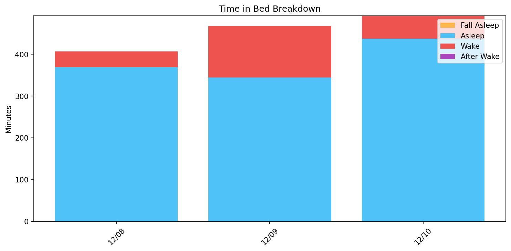
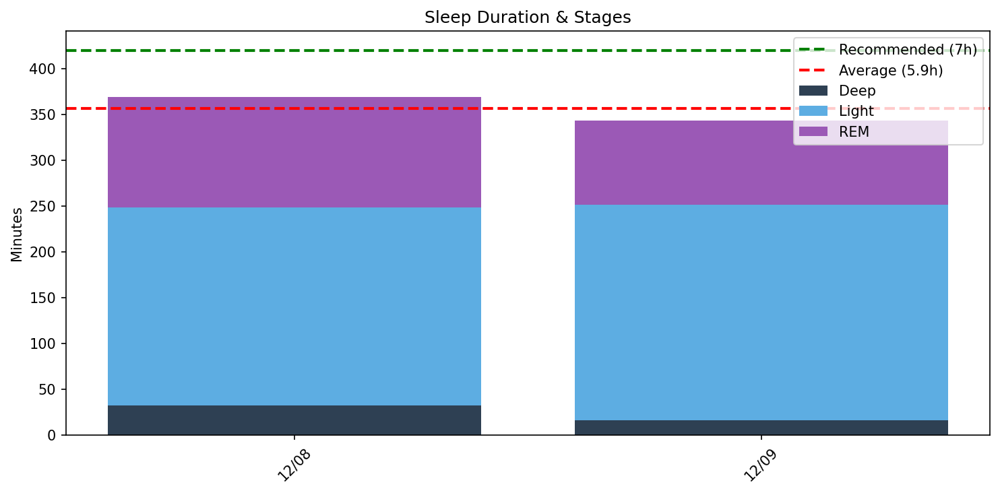
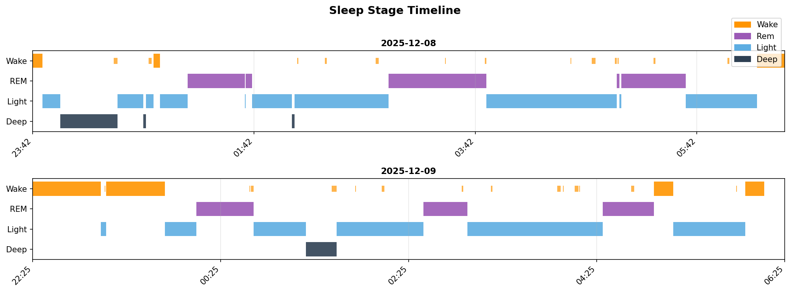

# 日次睡眠レポート

- **生成日時**: 2025-12-09 08:18:09
- **対象期間**: 2025-12-08 ～ 2025-12-09
- **データ日数**: 2日分

---

## サマリー

| 指標 | 値 |
|------|-----|
| ベッド時間合計 | 14.6時間 |
| 睡眠時間合計 | 11.9時間 |
| 睡眠負債 | **-2.1時間（不足）** |
| 目標達成 | 0/2日（7時間以上） |

> 睡眠負債は推奨7時間との差の累積です。

---

## Time in Bed分析

> ベッド時間の使い方を分析。効率 = 睡眠 / ベッド × 100。85%以上が良好。

| 指標 | 値 |
|------|-----|
| 平均効率 | **82.5%** |
| 最低〜最高 | 74% 〜 91% |
| 平均入眠 | 24分 |
| 平均起床後 | 14分 |

| 日付   | 効率   | 睡眠   | ベッド   | 入眠   | 起後   | 覚醒   | 回数   |
|:-------|:-------|:-------|:---------|:-------|:-------|:-------|:-------|
| 12/08  | 91%    | 6.2h   | 6.8h     | 6分    | 15分   | 38分   | 16回   |
| 12/09  | 74%    | 5.7h   | 7.8h     | 44分   | 12分   | 123分  | 18回   |

---

## Total Sleep Time分析

> 睡眠時間の質を分析。各ステージのバランスを確認。

### 睡眠時間

| 指標 | 値 |
|------|-----|
| 平均 | **5.9時間** (356分) |
| 最短〜最長 | 5.7 〜 6.2時間 |
| 標準偏差 | 0.3時間 |

### 睡眠ステージ（平均）

| ステージ | 時間 | 割合 | 回数 | 推奨範囲 |
|----------|------|------|------|----------|
| 深い睡眠 | 24分 | 6.7% | 2回 | 13-23% |
| 浅い睡眠 | 226分 | 63.3% | 16回 | 45-55% |
| レム睡眠 | 106分 | 29.9% | 7回 | 20-25% |
| 覚醒 | 80分 | - | - | - |

| 日付   | 睡眠   | 深い   | 浅い   | レム   |
|:-------|:-------|:-------|:-------|:-------|
| 12/08  | 6.2h   | 32分   | 216分  | 121分  |
| 12/09  | 5.7h   | 16分   | 235分  | 92分   |

### 睡眠ステージ タイムライン

- 🟠 覚醒 / 🟣 レム / 🔵 浅い / 🔷 深い

---

## 就寝・起床時刻

> 睡眠リズムの規則性を分析。ばらつきが大きいと社会的時差ボケの原因に。

| 指標 | 就寝 | 入眠 | 起床 | 離床 |
|------|------|------|------|------|
| 平均 | **23:03** | **23:28** | **06:07** | **06:21** |
| 最早 | 22:25 | 23:09 | 06:00 | 06:12 |
| 最遅 | 23:42 | 23:48 | 06:15 | 06:30 |
| ばらつき | ±54分 | ±20分 | ±8分 | ±13分 |

| 日付   | 就寝   | 入眠   | 起床   | 離床   |
|:-------|:-------|:-------|:-------|:-------|
| 12/08  | 23:42  | 23:48  | 06:15  | 06:30  |
| 12/09  | 22:25  | 23:09  | 06:00  | 06:12  |

---

## 睡眠サイクル分析

> 睡眠は約90分のサイクルで構成。深い睡眠は前半、REMは後半に集中するのが理想。

### サイクル構造の質

| 指標 | 平均値 | 正常範囲 |
|------|--------|----------|
| サイクル数 | 3.0回 | 3-5回 |
| サイクル長 | 117分 | 90分前後 |
| REM間隔 | 123分 | 90分前後 |
| 深い睡眠潜時 | 70分 | 15-30分 |
| REM潜時 | 70分 | 60-90分 |
| 前半の深い睡眠 | 100% | 70-80%以上 |

### 日別サイクル

| 日付   |   サイクル数 |   平均長 |   REM間隔 |   深い潜時 |   REM潜時 |   前半深い(%) |
|:-------|-------------:|---------:|----------:|-----------:|----------:|--------------:|
| 12/08  |            3 |      116 |       116 |         10 |        78 |           100 |
| 12/09  |            3 |      118 |       130 |        131 |        61 |           100 |

### REM開始時刻（夢想起用）

> 入眠からの経過時間。夢を覚えて起きたい場合、REM中に起床すると夢想起率が高い。

| 日付   |   REM1 |   REM2 |   REM3 | REM4   | 就寝   | REM1時   | REM2時   | REM3時   | REM4時   |
|:-------|-------:|-------:|-------:|:-------|:-------|:---------|:---------|:---------|:---------|
| 12/08  |     84 |    115 |    316 | -      | 23:42  | 01:06    | 01:38    | 04:59    | -        |
| 12/09  |    104 |    249 |    364 | -      | 22:25  | 00:10    | 02:35    | 04:29    | -        |
