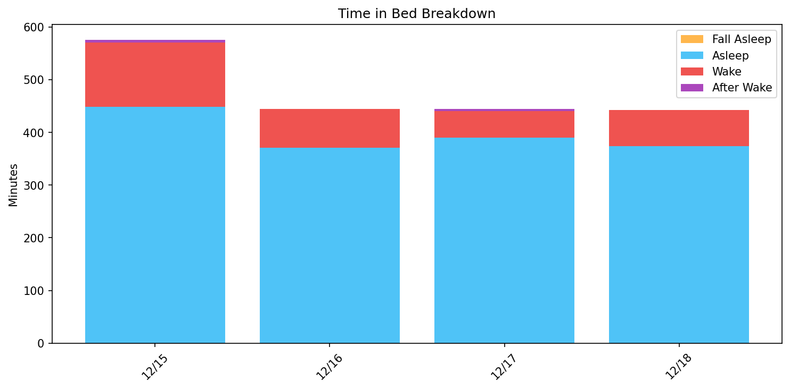
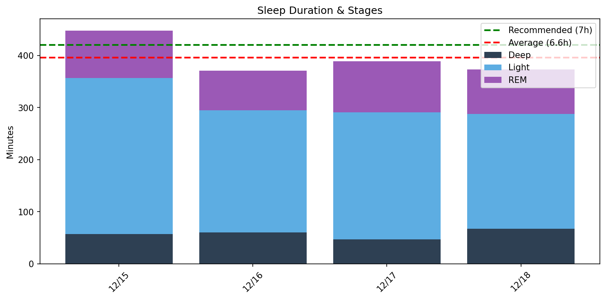
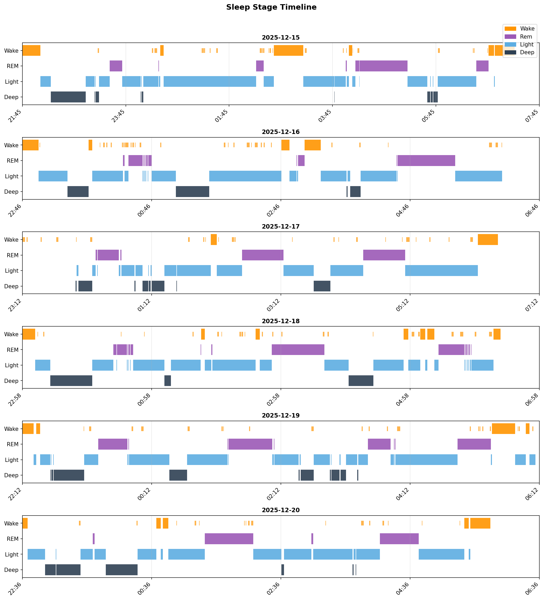

# 日次睡眠レポート

- **生成日時**: 2025-12-18 08:33:28
- **対象期間**: 2025-12-15 ～ 2025-12-18
- **データ日数**: 4日分

---

## サマリー

| 指標 | 値 |
|------|-----|
| ベッド時間合計 | 31.7時間 |
| 睡眠時間合計 | 26.4時間 |
| 睡眠負債 | **-1.6時間（不足）** |
| 目標達成 | 1/4日（7時間以上） |

> 睡眠負債は推奨7時間との差の累積です。

---

## Time in Bed分析

> ベッド時間の使い方を分析。効率 = 睡眠 / ベッド × 100。85%以上が良好。

| 指標 | 値 |
|------|-----|
| 平均効率 | **83.5%** |
| 最低〜最高 | 79% 〜 88% |
| 平均入眠 | 12分 |
| 平均起床後 | 12分 |

| 日付    | 効率   | 睡眠   | ベッド   | 入眠   | 起後   | 覚醒   | 回数   |
|:------|:-----|:-----|:------|:-----|:-----|:-----|:-----|
| 12/15 | 79%  | 7.5h | 9.5h  | 21分  | 23分  | 122分 | 29回  |
| 12/16 | 83%  | 6.2h | 7.4h  | 15分  | 0分   | 74分  | 33回  |
| 12/17 | 88%  | 6.5h | 7.3h  | 0分   | 18分  | 51分  | 25回  |
| 12/18 | 84%  | 6.2h | 7.4h  | 12分  | 6分   | 69分  | 29回  |

---

## Total Sleep Time分析

> 睡眠時間の質を分析。各ステージのバランスを確認。

### 睡眠時間

| 指標 | 値 |
|------|-----|
| 平均 | **6.6時間** (396分) |
| 最短〜最長 | 6.2 〜 7.5時間 |
| 標準偏差 | 0.6時間 |

### 睡眠ステージ（平均）

| ステージ | 時間 | 割合 | 回数 | 推奨範囲 |
|----------|------|------|------|----------|
| 深い睡眠 | 58分 | 14.6% | 6回 | 13-23% |
| 浅い睡眠 | 250分 | 63.1% | 36回 | 45-55% |
| レム睡眠 | 88分 | 22.1% | 13回 | 20-25% |
| 覚醒 | 79分 | - | - | - |

| 日付    | 睡眠   | 深い   | 浅い   | レム   |
|:------|:-----|:-----|:-----|:-----|
| 12/15 | 7.5h | 57分  | 300分 | 91分  |
| 12/16 | 6.2h | 60分  | 235分 | 76分  |
| 12/17 | 6.5h | 47分  | 244分 | 98分  |
| 12/18 | 6.2h | 67分  | 221分 | 85分  |

### 睡眠ステージ タイムライン

- 🟠 覚醒 / 🟣 レム / 🔵 浅い / 🔷 深い

---

## 就寝・起床時刻

> 睡眠リズムの規則性を分析。ばらつきが大きいと社会的時差ボケの原因に。

| 指標 | 就寝 | 入眠 | 起床 | 離床 |
|------|------|------|------|------|
| 平均 | **22:40** | **22:45** | **06:28** | **06:35** |
| 最早 | 21:45 | 22:06 | 06:15 | 06:11 |
| 最遅 | 23:12 | 23:10 | 06:53 | 07:16 |
| ばらつき | ±38分 | ±28分 | ±18分 | ±28分 |

| 日付    | 就寝    | 入眠    | 起床    | 離床    |
|:------|:------|:------|:------|:------|
| 12/15 | 21:45 | 22:06 | 06:53 | 07:16 |
| 12/16 | 22:46 | 23:01 | -     | 06:11 |
| 12/17 | 23:12 | -     | 06:15 | 06:33 |
| 12/18 | 22:58 | 23:10 | 06:16 | 06:22 |

---

## 睡眠サイクル分析

> 睡眠は約90分のサイクルで構成。深い睡眠は前半、REMは後半に集中するのが理想。

### サイクル構造の質

| 指標 | 平均値 | 正常範囲 |
|------|--------|----------|
| サイクル数 | 3.8回 | 3-5回 |
| サイクル長 | 109分 | 90分前後 |
| REM間隔 | 117分 | 90分前後 |
| 深い睡眠潜時 | 13分 | 15-30分 |
| REM潜時 | 62分 | 60-90分 |
| 前半の深い睡眠 | 62% | 70-80%以上 |

### 日別サイクル

| 日付    |   サイクル数 |   平均長 |   REM間隔 |   深い潜時 |   REM潜時 |   前半深い(%) |
|:------|--------:|------:|--------:|-------:|--------:|----------:|
| 12/15 |       5 |   104 |     106 |     12 |      80 |        81 |
| 12/16 |       4 |    97 |      85 |     27 |      78 |        32 |
| 12/17 |       3 |   102 |     124 |      0 |      18 |        69 |
| 12/18 |       3 |   133 |     151 |     14 |      72 |        66 |

### REM開始時刻（夢想起用）

> 入眠からの経過時間。夢を覚えて起きたい場合、REM中に起床すると夢想起率が高い。

| 日付    |   REM1 |   REM2 |   REM3 | REM4   | 就寝    | REM1時   | REM2時   | REM3時   | REM4時   |
|:------|-------:|-------:|-------:|:-------|:------|:--------|:--------|:--------|:--------|
| 12/15 |    101 |    158 |    375 | 391    | 21:45 | 23:26   | 00:23   | 04:00   | 04:16   |
| 12/16 |     93 |    112 |    254 | 347    | 22:46 | 00:19   | 00:38   | 03:00   | 04:33   |
| 12/17 |     68 |     91 |    316 | -      | 23:12 | 00:20   | 00:43   | 04:28   | -       |
| 12/18 |     84 |     97 |    386 | -      | 22:58 | 00:23   | 00:36   | 05:25   | -       |
