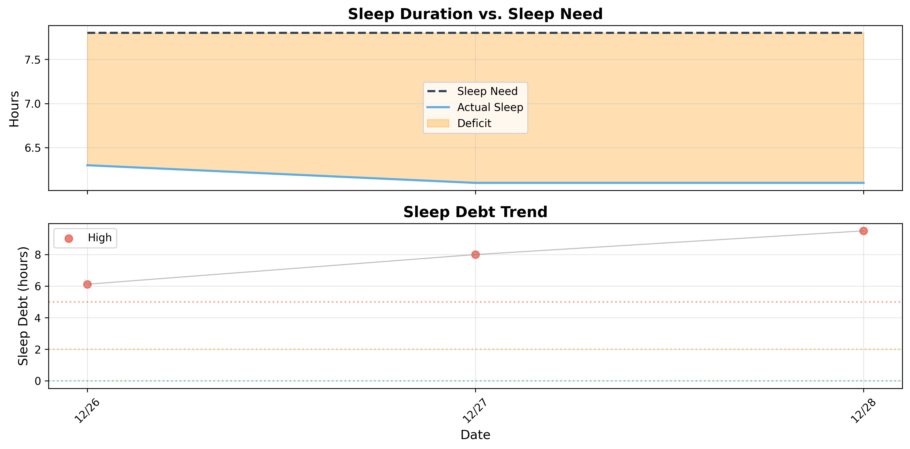
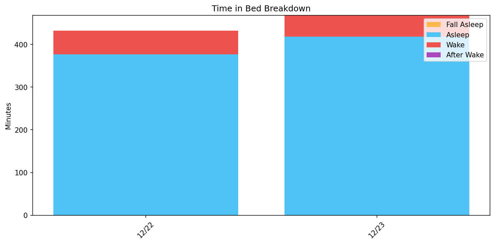
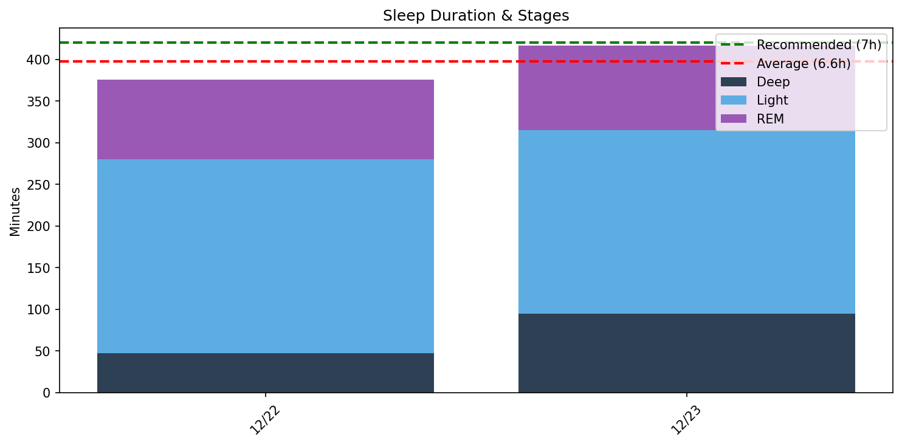
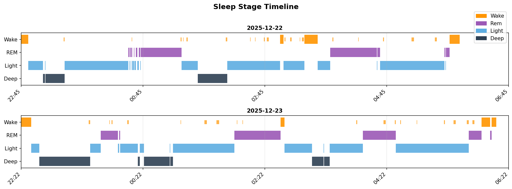

# 日次睡眠レポート

- **生成日時**: 2026-01-01 22:05:21
- **対象期間**: 2025-12-22 ～ 2025-12-28
- **データ日数**: 7日分

---

## サマリー

| 指標 | 値 |
|------|-----|
| ベッド時間合計 | 48.8時間 |
| 睡眠時間合計 | 42.7時間 |
| 睡眠負債 | **-6.3時間（不足）** |
| 目標達成 | 0/7日（7時間以上） |

> 睡眠負債は推奨7時間との差の累積です。
---

## 睡眠負債分析

### 最適睡眠時間の推定

- **推奨睡眠時間**: 7.8時間
- **習慣的睡眠時間**: 6.3時間
- **潜在的睡眠負債**: 1.6時間/日
- **信頼度**: low

**推奨理由**: 現在の習慣的睡眠時間（6.3h）は推奨値より1.6h少ない可能性があります。7時間以上の睡眠を試して、パフォーマンスの変化を観察することを推奨します。

### 現在の睡眠負債

- **カテゴリ**: High
- **睡眠負債**: 9.5時間
- **平均睡眠時間（過去14日）**: 6.1時間
- **推定回復日数**: 32日

⚠⚠⚠ 深刻な睡眠負債。優先的に睡眠時間を確保してください。

**回復アドバイス**: 32日で回復するには、毎晩8.1時間睡眠（+0.3h追加）

---

## Time in Bed分析

> ベッド時間の使い方を分析。効率 = 睡眠 / ベッド × 100。85%以上が良好。

| 指標 | 値 |
|------|-----|
| 平均効率 | **87.1%** |
| 最低〜最高 | 77% 〜 91% |
| 平均入眠 | 10分 |
| 平均起床後 | 10分 |

| 日付    | 効率   | 睡眠   | ベッド   | 入眠   | 起後   | 覚醒    | 回数    |
|:------|:-----|:-----|:------|:-----|:-----|:------|:------|
| 12/22 | 87%  | 6.3h | 7.2h  | 7分   | 10分  | 55.0分 | 23.0回 |
| 12/23 | 89%  | 7.0h | 7.8h  | 10分  | 4分   | 50.0分 | 22.0回 |
| 12/24 | 91%  | 6.8h | 7.5h  | 8分   | 7分   | 39.0分 | 28.0回 |
| 12/25 | 86%  | 6.6h | 7.7h  | 10分  | 14分  | 66.0分 | 22.0回 |
| 12/26 | 77%  | 4.7h | 6.2h  | 17分  | 38分  | 85.0分 | 18.0回 |
| 12/27 | 90%  | 5.5h | 6.0h  | 8分   | 0分   | 35.0分 | 24.0回 |
| 12/28 | 90%  | 5.8h | 6.4h  | 9分   | 0分   | 36.0分 | 20.0回 |
---

## Total Sleep Time分析

> 睡眠時間の質を分析。各ステージのバランスを確認。

### 睡眠時間

| 指標 | 値 |
|------|-----|
| 平均 | **6.1時間** (366分) |
| 最短〜最長 | 4.7 〜 7.0時間 |
| 標準偏差 | 0.8時間 |

### 睡眠ステージ（平均）

| ステージ | 時間 | 割合 | 回数 | 推奨範囲 |
|----------|------|------|------|----------|
| 深い睡眠 | 66分 | 18.1% | 7回 | 13-23% |
| 浅い睡眠 | 222分 | 60.6% | 27回 | 45-55% |
| レム睡眠 | 77分 | 21.1% | 10回 | 20-25% |
| 覚醒 | 52分 | - | - | - |

| 日付    | 睡眠   | 深い    | 浅い     | レム     |
|:------|:-----|:------|:-------|:-------|
| 12/22 | 6.3h | 47.0分 | 233.0分 | 96.0分  |
| 12/23 | 7.0h | 95.0分 | 220.0分 | 102.0分 |
| 12/24 | 6.8h | 69.0分 | 256.0分 | 84.0分  |
| 12/25 | 6.6h | 55.0分 | 243.0分 | 98.0分  |
| 12/26 | 4.7h | 56.0分 | 180.0分 | 47.0分  |
| 12/27 | 5.5h | 75.0分 | 220.0分 | 31.0分  |
| 12/28 | 5.8h | 67.0分 | 199.0分 | 82.0分  |

### 睡眠ステージ タイムライン

- 🟠 覚醒 / 🟣 レム / 🔵 浅い / 🔷 深い
---

## 就寝・起床時刻

> 睡眠リズムの規則性を分析。ばらつきが大きいと社会的時差ボケの原因に。

| 指標 | 就寝 | 入眠 | 起床 | 離床 |
|------|------|------|------|------|
| 平均 | **22:49** | **22:59** | **05:59** | **05:47** |
| 最早 | 22:22 | 22:32 | 05:47 | 04:32 |
| 最遅 | 00:21 | 00:38 | 06:14 | 06:30 |
| ばらつき | ±41分 | ±41分 | ±10分 | ±47分 |

| 日付    | 就寝    | 入眠    | 起床    | 離床    |
|:------|:------|:------|:------|:------|
| 12/22 | 22:45 | 22:52 | 05:47 | 05:57 |
| 12/23 | 22:22 | 22:32 | 06:06 | 06:10 |
| 12/24 | 22:36 | 22:44 | 05:58 | 06:05 |
| 12/25 | 22:44 | 22:54 | 06:14 | 06:28 |
| 12/26 | 00:21 | 00:38 | 05:52 | 06:30 |
| 12/27 | 22:29 | 22:38 | -     | 04:32 |
| 12/28 | 22:27 | 22:36 | -     | 04:52 |
---

## 睡眠サイクル分析

> 睡眠は約90分のサイクルで構成。深い睡眠は前半、REMは後半に集中するのが理想。

### サイクル構造の質

| 指標 | 平均値 | 正常範囲 |
|------|--------|----------|
| サイクル数 | 3.3回 | 3-5回 |
| サイクル長 | 112分 | 90分前後 |
| REM間隔 | 112分 | 90分前後 |
| 深い睡眠潜時 | 19分 | 15-30分 |
| REM潜時 | 76分 | 60-90分 |
| 前半の深い睡眠 | 80% | 70-80%以上 |

### 日別サイクル

| 日付    |   サイクル数 |   平均長 |   REM間隔 |   深い潜時 |   REM潜時 |   前半深い(%) |
|:------|--------:|------:|--------:|-------:|--------:|----------:|
| 12/22 |       3 |   114 |     100 |     14 |      98 |        42 |
| 12/23 |       4 |   111 |     121 |      8 |      68 |        82 |
| 12/24 |       3 |   121 |     124 |     14 |      72 |        90 |
| 12/25 |       4 |   110 |     120 |     54 |      71 |        72 |
| 12/26 |       2 |   122 |     126 |     16 |      83 |       100 |
| 12/27 |       3 |   114 |      97 |     16 |      81 |        76 |
| 12/28 |       4 |    90 |      97 |     11 |      62 |       100 |

### REM開始時刻（夢想起用）

> 入眠からの経過時間。夢を覚えて起きたい場合、REM中に起床すると夢想起率が高い。

| 日付    |   REM1 |   REM2 | REM3   | REM4   | 就寝    | REM1時   | REM2時   | REM3時   | REM4時   |
|:------|-------:|-------:|:-------|:-------|:------|:--------|:--------|:--------|:--------|
| 12/22 |    105 |    116 | 304    | -      | 22:45 | 00:30   | 00:41   | 03:49   | -       |
| 12/23 |     78 |     96 | 336    | 441    | 22:22 | 23:41   | 23:59   | 03:59   | 05:43   |
| 12/24 |     79 |    174 | 327    | -      | 22:36 | 23:56   | 01:30   | 04:04   | -       |
| 12/25 |     81 |     95 | 318    | 441    | 22:44 | 00:05   | 00:19   | 04:02   | 06:05   |
| 12/26 |    100 |    226 | -      | -      | 00:21 | 02:01   | 04:08   | -       | -       |
| 12/27 |     89 |    261 | 283    | -      | 22:29 | 23:59   | 02:51   | 03:13   | -       |
| 12/28 |     70 |    158 | 186    | 362    | 22:27 | 23:37   | 01:05   | 01:33   | 04:29   |
