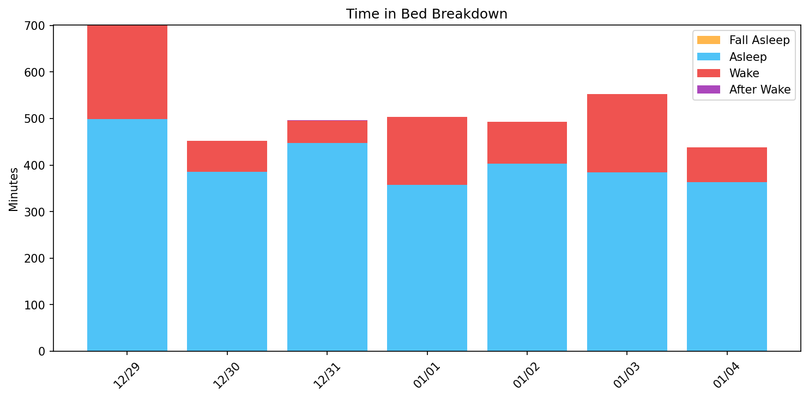
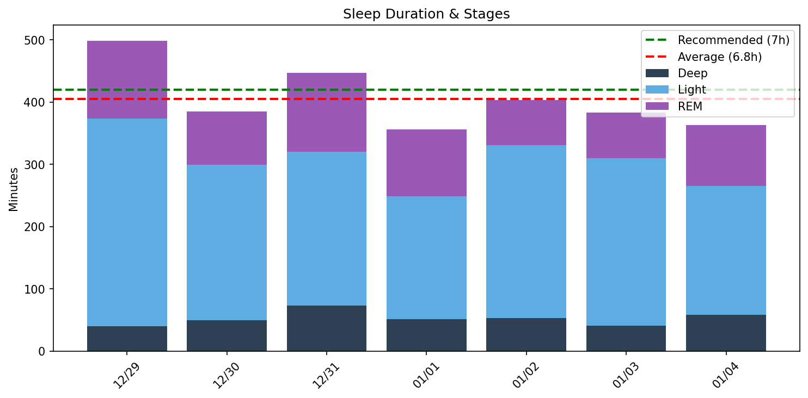
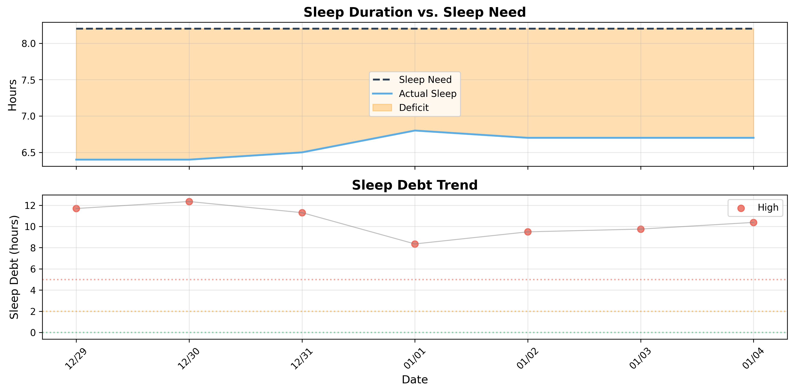

# 日次睡眠レポート

- **生成日時**: 2026-01-23 18:27:38
- **対象期間**: 2025-12-29 ～ 2026-01-04
- **データ日数**: 7日分

---

## サマリー

| 指標 | 値 |
|------|-----|
| ベッド時間合計 | 60.6時間 |
| 睡眠時間合計 | 47.3時間 |
| 平均睡眠時間 | 6.8時間/日 |

> 睡眠負債の詳細は下記の「睡眠負債分析」セクションを参照してください。
---

## Time in Bed分析

> ベッド時間の使い方を分析。効率 = 睡眠 / ベッド × 100。85%以上が良好。

| 指標 | 値 |
|------|-----|
| 平均効率 | **78.9%** |
| 最低〜最高 | 70% 〜 90% |
| 平均入眠 | 20分 |
| 平均起床後 | 7分 |

| 日付    | 効率   | 睡眠   | ベッド   | 入眠   | 起後   | 覚醒     | 回数    |
|:------|:-----|:-----|:------|:-----|:-----|:-------|:------|
| 12/29 | 71%  | 8.3h | 11.7h | 0分   | 0分   | 202.0分 | 46.0回 |
| 12/30 | 85%  | 6.4h | 7.5h  | 29分  | 0分   | 67.0分  | 23.0回 |
| 12/31 | 90%  | 7.5h | 8.2h  | 9分   | 6分   | 48.0分  | 29.0回 |
| 01/01 | 71%  | 6.0h | 8.4h  | 16分  | 0分   | 146.0分 | 43.0回 |
| 01/02 | 82%  | 6.7h | 8.2h  | 16分  | 4分   | 90.0分  | 36.0回 |
| 01/03 | 70%  | 6.4h | 9.2h  | 15分  | 40分  | 168.0分 | 26.0回 |
| 01/04 | 83%  | 6.0h | 7.3h  | 57分  | 0分   | 75.0分  | 12.0回 |
---

## Total Sleep Time分析

> 睡眠時間の質を分析。各ステージのバランスを確認。

### 睡眠時間

| 指標 | 値 |
|------|-----|
| 平均 | **6.8時間** (405分) |
| 最短〜最長 | 6.0 〜 8.3時間 |
| 標準偏差 | 0.8時間 |

### 睡眠ステージ（平均）

| ステージ | 時間 | 割合 | 回数 | 推奨範囲 |
|----------|------|------|------|----------|
| 深い睡眠 | 52分 | 12.9% | 8回 | 13-23% |
| 浅い睡眠 | 255分 | 62.8% | 34回 | 45-55% |
| レム睡眠 | 98分 | 24.2% | 14回 | 20-25% |
| 覚醒 | 114分 | - | - | - |

| 日付    | 睡眠   | 深い    | 浅い     | レム     |
|:------|:-----|:------|:-------|:-------|
| 12/29 | 8.3h | 40.0分 | 334.0分 | 125.0分 |
| 12/30 | 6.4h | 50.0分 | 249.0分 | 86.0分  |
| 12/31 | 7.5h | 73.0分 | 247.0分 | 127.0分 |
| 01/01 | 6.0h | 51.0分 | 198.0分 | 107.0分 |
| 01/02 | 6.7h | 53.0分 | 278.0分 | 72.0分  |
| 01/03 | 6.4h | 41.0分 | 269.0分 | 73.0分  |
| 01/04 | 6.0h | 58.0分 | 207.0分 | 98.0分  |

### 睡眠ステージ タイムライン

- 🟠 覚醒 / 🟣 レム / 🔵 浅い / 🔷 深い
---

## 就寝・起床時刻

> 睡眠リズムの規則性を分析。ばらつきが大きいと社会的時差ボケの原因に。

| 指標 | 就寝 | 入眠 | 起床 | 離床 |
|------|------|------|------|------|
| 平均 | **22:01** | **22:36** | **06:11** | **06:40** |
| 最早 | 20:50 | 21:23 | 05:34 | 05:28 |
| 最遅 | 23:12 | 23:28 | 07:19 | 08:32 |
| ばらつき | ±56分 | ±50分 | ±48分 | ±70分 |

| 日付    | 就寝    | 入眠    | 起床    | 離床    |
|:------|:------|:------|:------|:------|
| 12/29 | 20:50 | -     | -     | 08:32 |
| 12/30 | 22:14 | 22:43 | -     | 05:47 |
| 12/31 | 21:25 | 21:34 | 05:34 | 05:40 |
| 01/01 | 23:12 | 23:28 | -     | 07:35 |
| 01/02 | 23:09 | 23:25 | 07:19 | 07:23 |
| 01/03 | 21:08 | 21:23 | 05:41 | 06:20 |
| 01/04 | 22:09 | 23:06 | -     | 05:28 |
---

## 睡眠サイクル分析

> 睡眠は約90分のサイクルで構成。深い睡眠は前半、REMは後半に集中するのが理想。

### サイクル構造の質

| 指標 | 平均値 | 正常範囲 |
|------|--------|----------|
| サイクル数 | 4.4回 | 3-5回 |
| サイクル長 | 103分 | 90分前後 |
| REM間隔 | 106分 | 90分前後 |
| 深い睡眠潜時 | 25分 | 15-30分 |
| REM潜時 | 60分 | 60-90分 |
| 前半の深い睡眠 | 83% | 70-80%以上 |

### 日別サイクル

| 日付    |   サイクル数 |   平均長 |   REM間隔 |   深い潜時 |   REM潜時 |   前半深い(%) |
|:------|--------:|------:|--------:|-------:|--------:|----------:|
| 12/29 |       7 |    99 |      84 |     16 |      58 |        83 |
| 12/30 |       5 |    72 |      67 |     10 |      61 |       100 |
| 12/31 |       5 |    89 |      87 |     11 |      74 |        73 |
| 01/01 |       4 |   100 |      99 |      2 |      77 |        55 |
| 01/02 |       4 |   109 |     117 |      5 |      70 |        99 |
| 01/03 |       3 |   140 |     185 |    122 |       0 |        74 |
| 01/04 |       3 |   113 |     106 |     10 |      80 |       100 |

### REM開始時刻（夢想起用）

> 入眠からの経過時間。夢を覚えて起きたい場合、REM中に起床すると夢想起率が高い。

| 日付    | REM1   |   REM2 |   REM3 | REM4   | 就寝    | REM1時   | REM2時   | REM3時   | REM4時   |
|:------|:-------|-------:|-------:|:-------|:------|:--------|:--------|:--------|:--------|
| 12/29 | 57     |     74 |    201 | 304    | 20:50 | 21:48   | 22:04   | 00:11   | 01:54   |
| 12/30 | 90     |    189 |    316 | 333    | 22:14 | 23:44   | 01:23   | 03:30   | 03:47   |
| 12/31 | 83     |    176 |    297 | 340    | 21:25 | 22:48   | 00:21   | 02:22   | 03:05   |
| 01/01 | 93     |    208 |    251 | 390    | 23:12 | 00:45   | 02:40   | 03:23   | 05:42   |
| 01/02 | 86     |    107 |    298 | 438    | 23:09 | 00:35   | 00:57   | 04:08   | 06:27   |
| 01/03 | -      |    227 |    412 | -      | 21:08 | -       | 00:55   | 04:00   | -       |
| 01/04 | 137    |    167 |    350 | -      | 22:09 | 00:26   | 00:56   | 03:59   | -       |

## 睡眠負債分析

### 最適睡眠時間

- **最適睡眠時間**: 8.2時間
- **習慣的睡眠時間**: 5.7時間
- **潜在的睡眠負債**: 2.5時間/日
- **サンプル数**: 10日（上位4.0%）

> 睡眠時間上位4.0%（10日）の平均。習慣的睡眠（5.7h）より2.5h長く、睡眠不足からの回復を示唆。

睡眠リバウンド法は、睡眠時間が最も長かった上位4.0%の日（過去1年間）の平均を、真の睡眠必要量として推定する手法です。睡眠負債から完全に回復した日が、身体が本当に必要としている睡眠時間を示すという理論（RISEアプリと同じアルゴリズム）に基づいています。

### 現在の睡眠負債

- **睡眠負債**: 10.4時間
- **平均睡眠時間（過去14日）**: 6.7時間
- **平均睡眠時間（昼寝込み）**: 7.3時間
- **推定回復日数**: 35日

> 睡眠負債の計算には昼寝も含めた総睡眠時間を使用しています。回復日数は、1日あたり0.3時間のペースで睡眠負債が減少すると仮定して計算されています。

### 日別推移

| 日付    | 実績   | 負債    | 増減    | 回復   |
|:------|:-----|:------|:------|:-----|
| 12/29 | 8.3h | 11.7h | -     | 39日  |
| 12/30 | 6.4h | 12.3h | +0.7h | 42日  |
| 12/31 | 7.4h | 11.3h | -1.0h | 38日  |
| 01/01 | 9.6h | 8.3h  | -3.0h | 28日  |
| 01/02 | 6.7h | 9.5h  | +1.1h | 32日  |
| 01/03 | 6.4h | 9.8h  | +0.3h | 33日  |
| 01/04 | 6.0h | 10.4h | +0.6h | 35日  |

---
