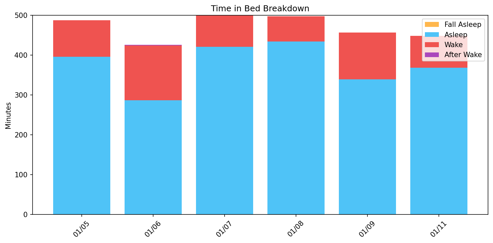
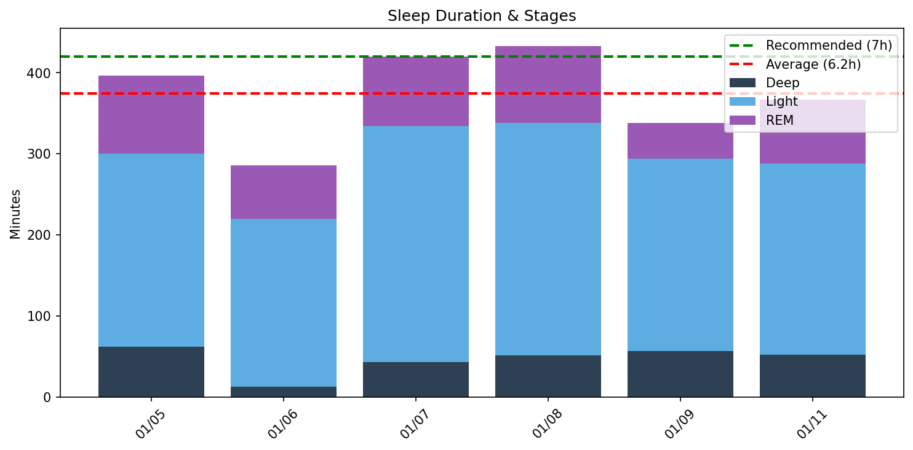
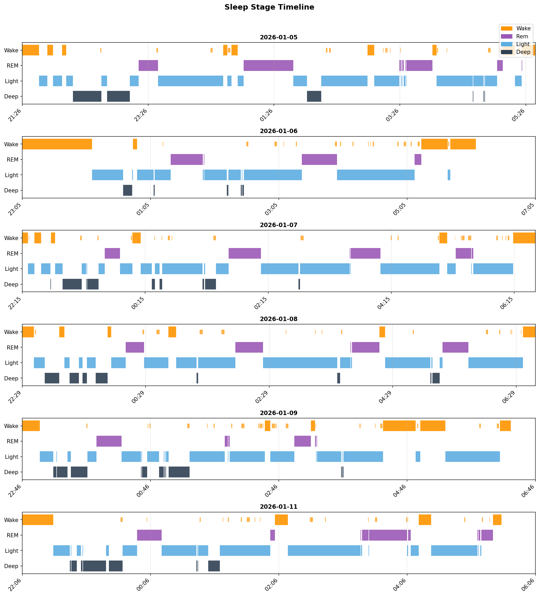
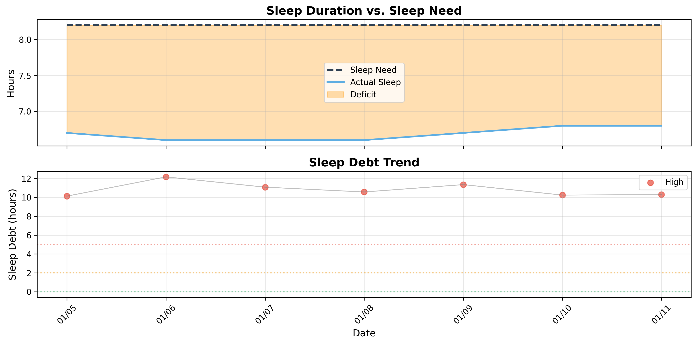

# 日次睡眠レポート

- **生成日時**: 2026-01-23 18:27:35
- **対象期間**: 2026-01-05 ～ 2026-01-11
- **データ日数**: 6日分

---

## サマリー

| 指標 | 値 |
|------|-----|
| ベッド時間合計 | 46.9時間 |
| 睡眠時間合計 | 37.4時間 |
| 平均睡眠時間 | 6.2時間/日 |

> 睡眠負債の詳細は下記の「睡眠負債分析」セクションを参照してください。
---

## Time in Bed分析

> ベッド時間の使い方を分析。効率 = 睡眠 / ベッド × 100。85%以上が良好。

| 指標 | 値 |
|------|-----|
| 平均効率 | **79.3%** |
| 最低〜最高 | 68% 〜 87% |
| 平均入眠 | 24分 |
| 平均起床後 | 15分 |

| 日付    | 効率   | 睡眠   | ベッド   | 入眠   | 起後   | 覚醒     | 回数    |
|:------|:-----|:-----|:------|:-----|:-----|:-------|:------|
| 01/05 | 81%  | 6.6h | 8.2h  | 16分  | 12分  | 92.0分  | 25.0回 |
| 01/06 | 68%  | 4.8h | 7.1h  | 66分  | 24分  | 137.0分 | 20.0回 |
| 01/07 | 84%  | 7.0h | 8.3h  | 6分   | 22分  | 79.0分  | 28.0回 |
| 01/08 | 87%  | 7.2h | 8.3h  | 12分  | 12分  | 64.0分  | 21.0回 |
| 01/09 | 74%  | 5.7h | 7.6h  | 16分  | 10分  | 118.0分 | 27.0回 |
| 01/11 | 82%  | 6.1h | 7.5h  | 29分  | 8分   | 80.0分  | 22.0回 |
---

## Total Sleep Time分析

> 睡眠時間の質を分析。各ステージのバランスを確認。

### 睡眠時間

| 指標 | 値 |
|------|-----|
| 平均 | **6.2時間** (374分) |
| 最短〜最長 | 4.8 〜 7.2時間 |
| 標準偏差 | 0.9時間 |

### 睡眠ステージ（平均）

| ステージ | 時間 | 割合 | 回数 | 推奨範囲 |
|----------|------|------|------|----------|
| 深い睡眠 | 46分 | 12.4% | 8回 | 13-23% |
| 浅い睡眠 | 249分 | 66.6% | 31回 | 45-55% |
| レム睡眠 | 78分 | 20.8% | 8回 | 20-25% |
| 覚醒 | 95分 | - | - | - |

| 日付    | 睡眠   | 深い    | 浅い     | レム    |
|:------|:-----|:------|:-------|:------|
| 01/05 | 6.6h | 62.0分 | 238.0分 | 96.0分 |
| 01/06 | 4.8h | 13.0分 | 207.0分 | 66.0分 |
| 01/07 | 7.0h | 43.0分 | 291.0分 | 86.0分 |
| 01/08 | 7.2h | 51.0分 | 287.0分 | 95.0分 |
| 01/09 | 5.7h | 57.0分 | 237.0分 | 44.0分 |
| 01/11 | 6.1h | 52.0分 | 236.0分 | 79.0分 |

### 睡眠ステージ タイムライン

- 🟠 覚醒 / 🟣 レム / 🔵 浅い / 🔷 深い
---

## 就寝・起床時刻

> 睡眠リズムの規則性を分析。ばらつきが大きいと社会的時差ボケの原因に。

| 指標 | 就寝 | 入眠 | 起床 | 離床 |
|------|------|------|------|------|
| 平均 | **22:21** | **22:45** | **05:56** | **06:10** |
| 最早 | 21:26 | 21:42 | 05:23 | 05:34 |
| 最遅 | 23:05 | 00:10 | 06:35 | 06:47 |
| ばらつき | ±34分 | ±45分 | ±27分 | ±31分 |

| 日付    | 就寝    | 入眠    | 起床    | 離床    |
|:------|:------|:------|:------|:------|
| 01/05 | 21:26 | 21:42 | 05:23 | 05:35 |
| 01/06 | 23:05 | 00:10 | 05:45 | 06:09 |
| 01/07 | 22:15 | 22:20 | 06:14 | 06:35 |
| 01/08 | 22:29 | 22:40 | 06:35 | 06:47 |
| 01/09 | 22:46 | 23:03 | 06:13 | 06:23 |
| 01/11 | 22:06 | 22:35 | 05:26 | 05:34 |
---

## 睡眠サイクル分析

> 睡眠は約90分のサイクルで構成。深い睡眠は前半、REMは後半に集中するのが理想。

### サイクル構造の質

| 指標 | 平均値 | 正常範囲 |
|------|--------|----------|
| サイクル数 | 3.8回 | 3-5回 |
| サイクル長 | 109分 | 90分前後 |
| REM間隔 | 102分 | 90分前後 |
| 深い睡眠潜時 | 20分 | 15-30分 |
| REM潜時 | 77分 | 60-90分 |
| 前半の深い睡眠 | 92% | 70-80%以上 |

### 日別サイクル

| 日付    |   サイクル数 |   平均長 |   REM間隔 |   深い潜時 |   REM潜時 |   前半深い(%) |
|:------|--------:|------:|--------:|-------:|--------:|----------:|
| 01/05 |       4 |   110 |     114 |     32 |      95 |        76 |
| 01/06 |       3 |   103 |     114 |     29 |      74 |       100 |
| 01/07 |       4 |   108 |     114 |     22 |      75 |        97 |
| 01/08 |       4 |   106 |     103 |     10 |      89 |        79 |
| 01/09 |       3 |   147 |     102 |     12 |      53 |        98 |
| 01/11 |       5 |    82 |      63 |     16 |      78 |       100 |

### REM開始時刻（夢想起用）

> 入眠からの経過時間。夢を覚えて起きたい場合、REM中に起床すると夢想起率が高い。

| 日付    |   REM1 |   REM2 |   REM3 | REM4   | 就寝    | REM1時   | REM2時   | REM3時   | REM4時   |
|:------|-------:|-------:|-------:|:-------|:------|:--------|:--------|:--------|:--------|
| 01/05 |    111 |    211 |    359 | 452    | 21:26 | 23:17   | 00:57   | 03:26   | 04:59   |
| 01/06 |    139 |    170 |    367 | -      | 23:05 | 01:24   | 01:55   | 05:12   | -       |
| 01/07 |     80 |    201 |    319 | 423    | 22:15 | 23:35   | 01:36   | 03:34   | 05:18   |
| 01/08 |    100 |    207 |    319 | 408    | 22:29 | 00:09   | 01:56   | 03:48   | 05:17   |
| 01/09 |     69 |    189 |    274 | -      | 22:46 | 23:56   | 01:56   | 03:20   | -       |
| 01/11 |    107 |    232 |    316 | 324    | 22:06 | 23:53   | 01:58   | 03:22   | 03:30   |

## 睡眠負債分析

### 最適睡眠時間

- **最適睡眠時間**: 8.2時間
- **習慣的睡眠時間**: 5.7時間
- **潜在的睡眠負債**: 2.5時間/日
- **サンプル数**: 10日（上位4.0%）

> 睡眠時間上位4.0%（10日）の平均。習慣的睡眠（5.7h）より2.5h長く、睡眠不足からの回復を示唆。

睡眠リバウンド法は、睡眠時間が最も長かった上位4.0%の日（過去1年間）の平均を、真の睡眠必要量として推定する手法です。睡眠負債から完全に回復した日が、身体が本当に必要としている睡眠時間を示すという理論（RISEアプリと同じアルゴリズム）に基づいています。

### 現在の睡眠負債

- **睡眠負債**: 10.3時間
- **平均睡眠時間（過去14日）**: 6.8時間
- **平均睡眠時間（昼寝込み）**: 6.2時間
- **推定回復日数**: 35日

> 睡眠負債の計算には昼寝も含めた総睡眠時間を使用しています。回復日数は、1日あたり0.3時間のペースで睡眠負債が減少すると仮定して計算されています。

### 日別推移

| 日付    | 実績   | 負債    | 増減    | 回復   |
|:------|:-----|:------|:------|:-----|
| 01/05 | 6.6h | 10.1h | -     | 34日  |
| 01/06 | 4.8h | 12.2h | +2.0h | 41日  |
| 01/07 | 7.0h | 11.1h | -1.1h | 37日  |
| 01/08 | 7.2h | 10.6h | -0.5h | 36日  |
| 01/09 | 5.6h | 11.3h | +0.8h | 38日  |
| 01/10 | 0.0h | 10.2h | -1.1h | 35日  |
| 01/11 | 6.1h | 10.3h | +0.0h | 35日  |

---
