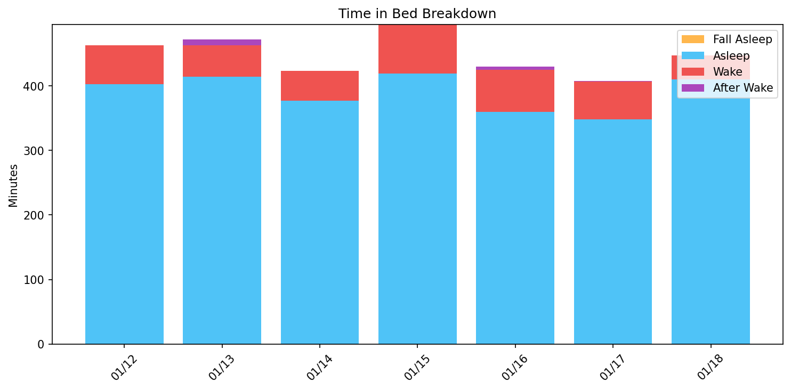
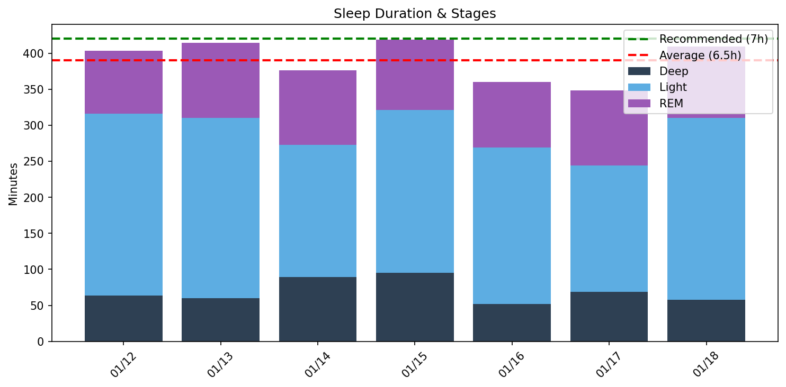
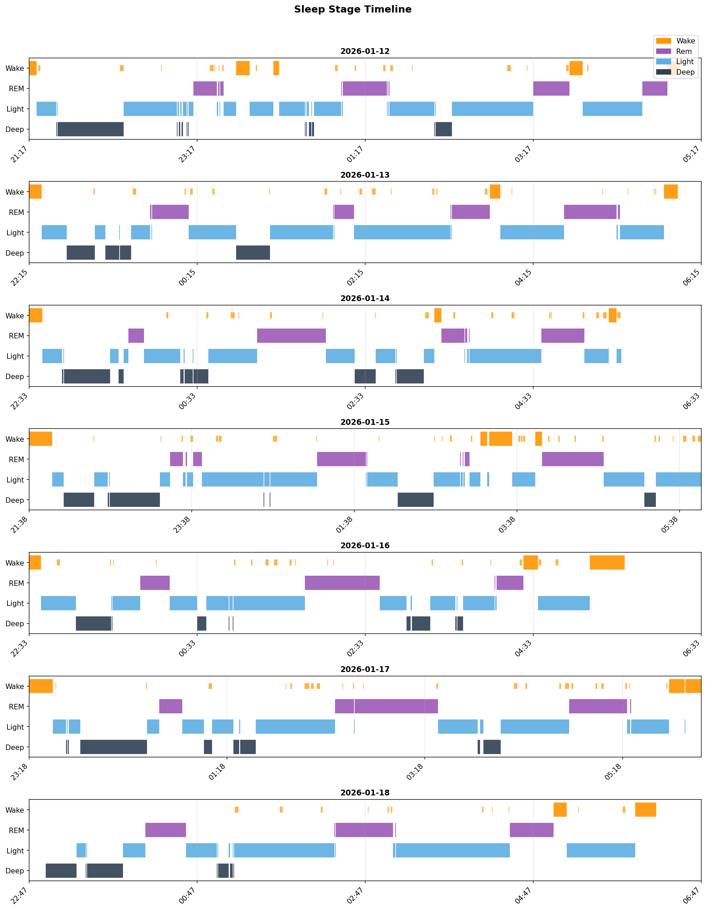
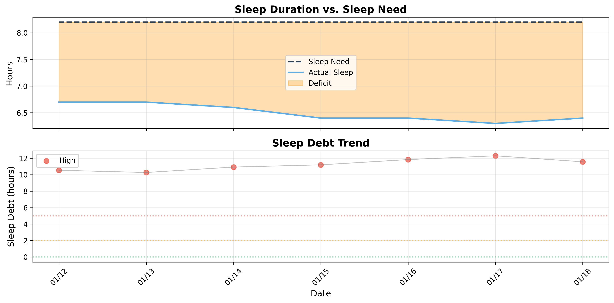

# 日次睡眠レポート

- **生成日時**: 2026-01-23 18:27:31
- **対象期間**: 2026-01-12 ～ 2026-01-18
- **データ日数**: 7日分

---

## サマリー

| 指標 | 値 |
|------|-----|
| ベッド時間合計 | 52.1時間 |
| 睡眠時間合計 | 45.5時間 |
| 平均睡眠時間 | 6.5時間/日 |

> 睡眠負債の詳細は下記の「睡眠負債分析」セクションを参照してください。
---

## Time in Bed分析

> ベッド時間の使い方を分析。効率 = 睡眠 / ベッド × 100。85%以上が良好。

| 指標 | 値 |
|------|-----|
| 平均効率 | **87.4%** |
| 最低〜最高 | 84% 〜 92% |
| 平均入眠 | 9分 |
| 平均起床後 | 10分 |

| 日付    | 効率   | 睡眠   | ベッド   | 入眠   | 起後   | 覚醒    | 回数    |
|:------|:-----|:-----|:------|:-----|:-----|:------|:------|
| 01/12 | 87%  | 6.7h | 7.7h  | 6分   | 8分   | 60.0分 | 23.0回 |
| 01/13 | 89%  | 6.9h | 7.7h  | 9分   | 10分  | 49.0分 | 22.0回 |
| 01/14 | 89%  | 6.3h | 7.0h  | 10分  | 0分   | 46.0分 | 20.0回 |
| 01/15 | 84%  | 7.0h | 8.3h  | 17分  | 0分   | 76.0分 | 30.0回 |
| 01/16 | 85%  | 6.0h | 7.1h  | 8分   | 25分  | 65.0分 | 21.0回 |
| 01/17 | 86%  | 5.8h | 6.8h  | 14分  | 10分  | 59.0分 | 25.0回 |
| 01/18 | 92%  | 6.8h | 7.5h  | 0分   | 15分  | 37.0分 | 14.0回 |
---

## Total Sleep Time分析

> 睡眠時間の質を分析。各ステージのバランスを確認。

### 睡眠時間

| 指標 | 値 |
|------|-----|
| 平均 | **6.5時間** (390分) |
| 最短〜最長 | 5.8 〜 7.0時間 |
| 標準偏差 | 0.5時間 |

### 睡眠ステージ（平均）

| ステージ | 時間 | 割合 | 回数 | 推奨範囲 |
|----------|------|------|------|----------|
| 深い睡眠 | 70分 | 17.8% | 8回 | 13-23% |
| 浅い睡眠 | 222分 | 57.0% | 27回 | 45-55% |
| レム睡眠 | 98分 | 25.1% | 11回 | 20-25% |
| 覚醒 | 56分 | - | - | - |

| 日付    | 睡眠   | 深い    | 浅い     | レム     |
|:------|:-----|:------|:-------|:-------|
| 01/12 | 6.7h | 64.0分 | 252.0分 | 87.0分  |
| 01/13 | 6.9h | 60.0分 | 250.0分 | 104.0分 |
| 01/14 | 6.3h | 89.0分 | 184.0分 | 103.0分 |
| 01/15 | 7.0h | 95.0分 | 226.0分 | 98.0分  |
| 01/16 | 6.0h | 52.0分 | 217.0分 | 91.0分  |
| 01/17 | 5.8h | 69.0分 | 175.0分 | 104.0分 |
| 01/18 | 6.8h | 58.0分 | 252.0分 | 99.0分  |

### 睡眠ステージ タイムライン

- 🟠 覚醒 / 🟣 レム / 🔵 浅い / 🔷 深い
---

## 就寝・起床時刻

> 睡眠リズムの規則性を分析。ばらつきが大きいと社会的時差ボケの原因に。

| 指標 | 就寝 | 入眠 | 起床 | 離床 |
|------|------|------|------|------|
| 平均 | **22:20** | **22:26** | **05:34** | **05:46** |
| 最早 | 21:17 | 21:23 | 04:53 | 05:01 |
| 最遅 | 23:18 | 23:32 | 06:00 | 06:15 |
| ばらつき | ±41分 | ±40分 | ±26分 | ±24分 |

| 日付    | 就寝    | 入眠    | 起床    | 離床    |
|:------|:------|:------|:------|:------|
| 01/12 | 21:17 | 21:23 | 04:53 | 05:01 |
| 01/13 | 22:15 | 22:24 | 05:48 | 05:58 |
| 01/14 | 22:33 | 22:43 | -     | 05:36 |
| 01/15 | 21:38 | 21:55 | -     | 05:54 |
| 01/16 | 22:33 | 22:41 | 05:13 | 05:38 |
| 01/17 | 23:18 | 23:32 | 05:56 | 06:05 |
| 01/18 | 22:47 | -     | 06:00 | 06:15 |
---

## 睡眠サイクル分析

> 睡眠は約90分のサイクルで構成。深い睡眠は前半、REMは後半に集中するのが理想。

### サイクル構造の質

| 指標 | 平均値 | 正常範囲 |
|------|--------|----------|
| サイクル数 | 3.7回 | 3-5回 |
| サイクル長 | 105分 | 90分前後 |
| REM間隔 | 90分 | 90分前後 |
| 深い睡眠潜時 | 12分 | 15-30分 |
| REM潜時 | 78分 | 60-90分 |
| 前半の深い睡眠 | 80% | 70-80%以上 |

### 日別サイクル

| 日付    |   サイクル数 |   平均長 |   REM間隔 |   深い潜時 |   REM潜時 |   前半深い(%) |
|:------|--------:|------:|--------:|-------:|--------:|----------:|
| 01/12 |       4 |   113 |     107 |     14 |     112 |        82 |
| 01/13 |       4 |   103 |      98 |     18 |      78 |       100 |
| 01/14 |       4 |    97 |      80 |     14 |      62 |        62 |
| 01/15 |       4 |   102 |      48 |      8 |      87 |        69 |
| 01/16 |       3 |   115 |     126 |     25 |      71 |        61 |
| 01/17 |       4 |    87 |      83 |      8 |      64 |        83 |
| 01/18 |       3 |   121 |      89 |      0 |      71 |       100 |

### REM開始時刻（夢想起用）

> 入眠からの経過時間。夢を覚えて起きたい場合、REM中に起床すると夢想起率が高い。

| 日付    |   REM1 |   REM2 |   REM3 | REM4   | 就寝    | REM1時   | REM2時   | REM3時   | REM4時   |
|:------|-------:|-------:|-------:|:-------|:------|:--------|:--------|:--------|:--------|
| 01/12 |    117 |    135 |    256 | 438    | 21:17 | 23:15   | 23:32   | 01:33   | 04:35   |
| 01/13 |     86 |    217 |    301 | 382    | 22:15 | 23:41   | 01:52   | 03:16   | 04:37   |
| 01/14 |     71 |    163 |    294 | 311    | 22:33 | 23:44   | 01:16   | 03:28   | 03:45   |
| 01/15 |    104 |    115 |    212 | 249    | 21:38 | 23:22   | 23:34   | 01:11   | 01:47   |
| 01/16 |     79 |    197 |    332 | -      | 22:33 | 23:52   | 01:50   | 04:05   | -       |
| 01/17 |     79 |    185 |    197 | 327    | 23:18 | 00:37   | 02:23   | 02:35   | 04:45   |
| 01/18 |     83 |    218 |    261 | -      | 22:47 | 00:10   | 02:25   | 03:09   | -       |

## 睡眠負債分析

### 最適睡眠時間

- **最適睡眠時間**: 8.2時間
- **習慣的睡眠時間**: 5.7時間
- **潜在的睡眠負債**: 2.5時間/日
- **サンプル数**: 10日（上位4.0%）

> 睡眠時間上位4.0%（10日）の平均。習慣的睡眠（5.7h）より2.5h長く、睡眠不足からの回復を示唆。

睡眠リバウンド法は、睡眠時間が最も長かった上位4.0%の日（過去1年間）の平均を、真の睡眠必要量として推定する手法です。睡眠負債から完全に回復した日が、身体が本当に必要としている睡眠時間を示すという理論（RISEアプリと同じアルゴリズム）に基づいています。

### 現在の睡眠負債

- **睡眠負債**: 11.6時間
- **平均睡眠時間（過去14日）**: 6.4時間
- **平均睡眠時間（昼寝込み）**: 6.5時間
- **推定回復日数**: 39日

> 睡眠負債の計算には昼寝も含めた総睡眠時間を使用しています。回復日数は、1日あたり0.3時間のペースで睡眠負債が減少すると仮定して計算されています。

### 日別推移

| 日付    | 実績   | 負債    | 増減    | 回復   |
|:------|:-----|:------|:------|:-----|
| 01/12 | 6.7h | 10.5h | -     | 36日  |
| 01/13 | 6.9h | 10.3h | -0.3h | 35日  |
| 01/14 | 6.3h | 10.9h | +0.7h | 37日  |
| 01/15 | 7.0h | 11.2h | +0.3h | 38日  |
| 01/16 | 6.0h | 11.8h | +0.6h | 40日  |
| 01/17 | 5.8h | 12.3h | +0.5h | 41日  |
| 01/18 | 6.8h | 11.6h | -0.7h | 39日  |

---
