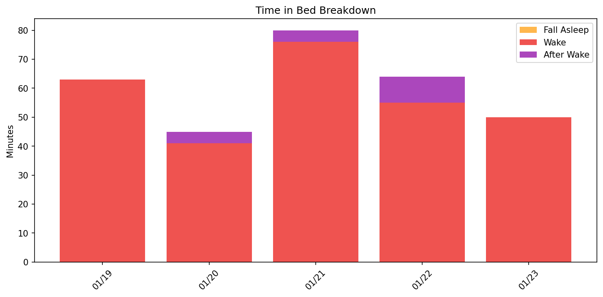
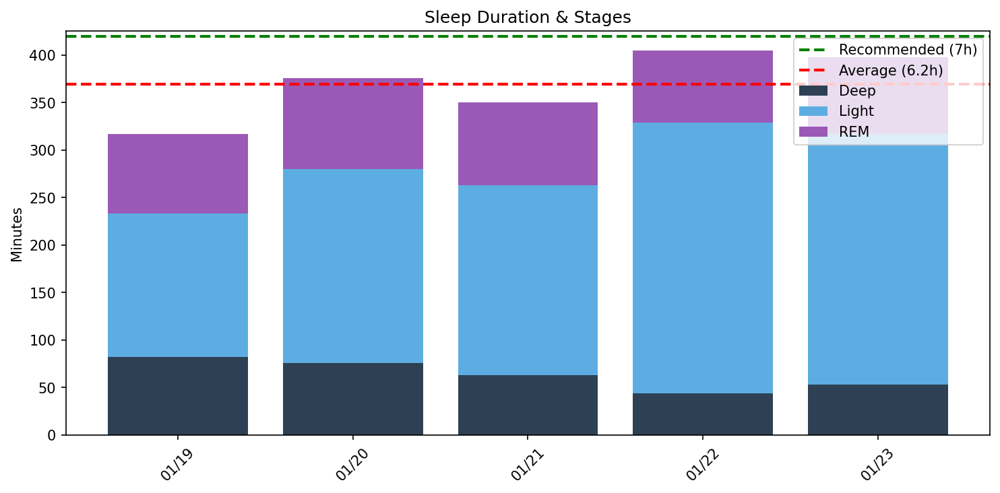
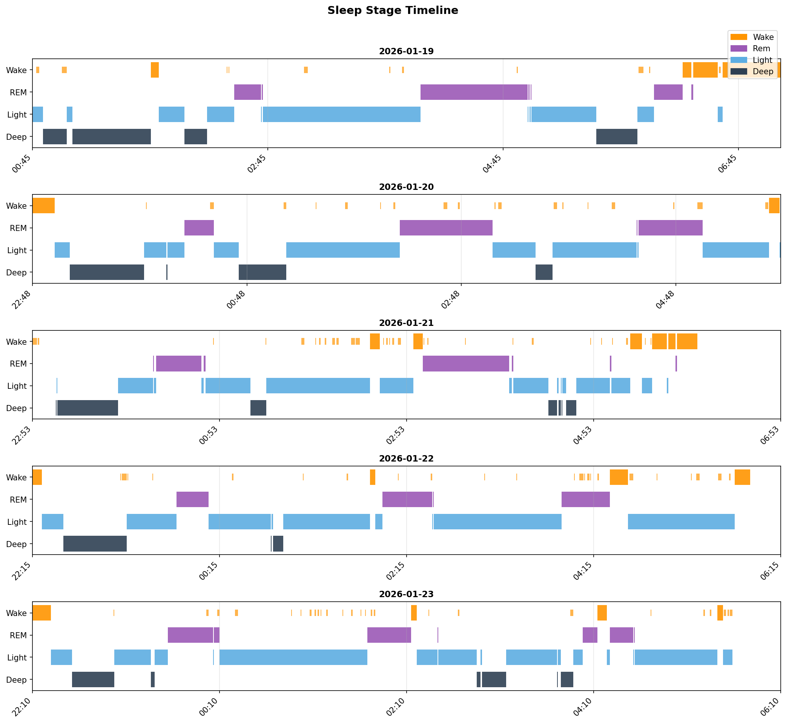
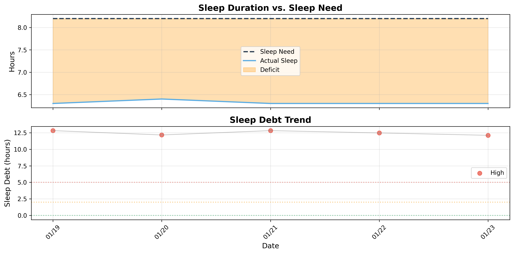

# 日次睡眠レポート

- **生成日時**: 2026-01-23 20:37:31
- **対象期間**: 2026-01-19 ～ 2026-01-23
- **データ日数**: 5日分

---

## サマリー

| 指標 | 値 |
|------|-----|
| ベッド時間合計 | 35.6時間 |
| 睡眠時間合計 | 30.8時間 |
| 平均睡眠時間 | 6.2時間/日 |

> 睡眠負債の詳細は下記の「睡眠負債分析」セクションを参照してください。
---

## Time in Bed分析

> ベッド時間の使い方を分析。効率 = 睡眠 / ベッド × 100。85%以上が良好。

| 指標 | 値 |
|------|-----|
| 平均効率 | **86.4%** |
| 最低〜最高 | 82% 〜 90% |
| 平均入眠 | 6分 |
| 平均起床後 | 10分 |

| 日付   | 効率   | 睡眠   | ベッド   | 入眠   | 起後   | 覚醒   | 回数   |
|:-------|:-------|:-------|:---------|:-------|:-------|:-------|:-------|
| 01/19  | 83%    | 5.3h   | 6.3h     | 0分    | 30分   | 63.0分 | 15.0回 |
| 01/20  | 90%    | 6.3h   | 7.0h     | 12分   | 0分    | 41.0分 | 20.0回 |
| 01/21  | 82%    | 5.8h   | 7.1h     | 0分    | 13分   | 76.0分 | 34.0回 |
| 01/22  | 88%    | 6.8h   | 7.7h     | 6分    | 10分   | 55.0分 | 27.0回 |
| 01/23  | 89%    | 6.6h   | 7.5h     | 12分   | 0分    | 50.0分 | 30.0回 |
---

## Total Sleep Time分析

> 睡眠時間の質を分析。各ステージのバランスを確認。

### 睡眠時間

| 指標 | 値 |
|------|-----|
| 平均 | **6.2時間** (370分) |
| 最短〜最長 | 5.3 〜 6.8時間 |
| 標準偏差 | 0.6時間 |

### 睡眠ステージ（平均）

| ステージ | 時間 | 割合 | 回数 | 推奨範囲 |
|----------|------|------|------|----------|
| 深い睡眠 | 64分 | 17.2% | 5回 | 13-23% |
| 浅い睡眠 | 221分 | 59.7% | 27回 | 45-55% |
| レム睡眠 | 85分 | 22.9% | 9回 | 20-25% |
| 覚醒 | 57分 | - | - | - |

| 日付   | 睡眠   | 深い   | 浅い    | レム   |
|:-------|:-------|:-------|:--------|:-------|
| 01/19  | 5.3h   | 82.0分 | 151.0分 | 84.0分 |
| 01/20  | 6.3h   | 76.0分 | 204.0分 | 96.0分 |
| 01/21  | 5.8h   | 63.0分 | 200.0分 | 87.0分 |
| 01/22  | 6.8h   | 44.0分 | 285.0分 | 76.0分 |
| 01/23  | 6.6h   | 53.0分 | 264.0分 | 81.0分 |

### 睡眠ステージ タイムライン

- 🟠 覚醒 / 🟣 レム / 🔵 浅い / 🔷 深い
---

## 就寝・起床時刻

> 睡眠リズムの規則性を分析。ばらつきが大きいと社会的時差ボケの原因に。

| 指標 | 就寝 | 入眠 | 起床 | 離床 |
|------|------|------|------|------|
| 平均 | **22:58** | **22:34** | **06:02** | **06:05** |
| 最早 | 22:10 | 22:21 | 05:45 | 05:39 |
| 最遅 | 00:45 | 23:00 | 06:37 | 07:06 |
| ばらつき | ±63分 | ±18分 | ±24分 | ±35分 |

| 日付   | 就寝   | 入眠   | 起床   | 離床   |
|:-------|:-------|:-------|:-------|:-------|
| 01/19  | 00:45  | -      | 06:37  | 07:06  |
| 01/20  | 22:48  | 23:00  | -      | 05:46  |
| 01/21  | 22:53  | -      | 05:46  | 05:59  |
| 01/22  | 22:15  | 22:21  | 05:45  | 05:55  |
| 01/23  | 22:10  | 22:22  | -      | 05:39  |
---

## 睡眠中の心拍数

| 日付 | 平均 | 最小 | 最大 | 安静時 | ベースライン比較 | ディップ率(%) | 最低HR到達(分) |
|------|------|------|------|--------|------------------|---------------|----------------|
| 01/19 | 54 | 45 | 79 | 56 | 高37% / 低63% | 16.9 | 226 |
| 01/20 | 48 | 40 | 68 | 53 | 高5% / 低95% | 27.2 | 329 |
| 01/21 | 48 | 42 | 89 | 53 | 高6% / 低94% | 38.2 | 106 |
| 01/22 | 50 | 44 | 90 | 54 | 高9% / 低91% | 26.2 | 258 |
| 01/23 | 53 | 48 | 74 | 56 | 高27% / 低73% | 21.2 | 105 |

**ベースライン**: 過去7日間の平均安静時心拍数（54.9 bpm）

### 高度な心拍数指標

- **平均ディップ率**: 26.0%
  - 健康な人は睡眠中に心拍数が日中の10-20%低下します
  - 10%未満の場合は「非ディッパー」で心血管リスクが2.4倍に増加
- **平均最低HR到達時間**: 205分
  - 入眠後、副交感神経が活性化し心拍数が低下します
  - 健康な範囲は60-180分程度

> ほとんどの人の場合、睡眠中の心拍数は、起きているときの安静時心拍数よりも平均して低くなります。

## 自律神経バランス（HRV Intraday）

睡眠中の心拍変動（HRV）から自律神経の状態を評価します。

### 主要指標

- **平均LF/HF比**: 4.65
  - 自律神経バランスの指標（低いほど副交感神経優位、リラックス状態）
  - 覚醒時より低い値が望ましい
- **HF変化率（入眠後30-60分）**: -28.4%
  - 入眠初期のHF成分の変化
  - 正の値は副交感神経の活性化、負の値は変動を示す
- **LF/HF変化率（入眠後→起床前）**: -327.5%
  - 睡眠中のLF/HF比の変化
  - 正の値は睡眠中にリラックスが進んだことを示す

### HRVの意味

- **HF（高周波成分）**: 副交感神経活動の指標。高いほどリラックス状態
- **LF（低周波成分）**: 交感神経と副交感神経の混合指標
- **LF/HF比**: 自律神経バランス。睡眠中は低下するのが理想的

> 睡眠中のHRVは、回復の質を評価する重要な指標です。副交感神経が優位になることで、身体が効果的に回復します。

---

## 睡眠サイクル分析

> 睡眠は約90分のサイクルで構成。深い睡眠は前半、REMは後半に集中するのが理想。

### サイクル構造の質

| 指標 | 平均値 | 正常範囲 |
|------|--------|----------|
| サイクル数 | 3.0回 | 3-5回 |
| サイクル長 | 118分 | 90分前後 |
| REM間隔 | 82分 | 90分前後 |
| 深い睡眠潜時 | 8分 | 15-30分 |
| REM潜時 | 80分 | 60-90分 |
| 前半の深い睡眠 | 83% | 70-80%以上 |

### 日別サイクル

| 日付   |   サイクル数 |   平均長 |   REM間隔 |   深い潜時 |   REM潜時 |   前半深い(%) |
|:-------|-------------:|---------:|----------:|-----------:|----------:|--------------:|
| 01/19  |            3 |      110 |        75 |          6 |       103 |            75 |
| 01/20  |            3 |      121 |       126 |          8 |        72 |            88 |
| 01/21  |            2 |      146 |        32 |          0 |        62 |           100 |
| 01/22  |            3 |      122 |        82 |         14 |        86 |           100 |
| 01/23  |            4 |       93 |        94 |         14 |        75 |            53 |

## 睡眠負債分析

### 最適睡眠時間

- **最適睡眠時間**: 8.2時間
- **習慣的睡眠時間**: 5.7時間
- **潜在的睡眠負債**: 2.5時間/日
- **サンプル数**: 10日（上位4.0%）

> 睡眠時間上位4.0%（10日）の平均。習慣的睡眠（5.7h）より2.5h長く、睡眠不足からの回復を示唆。

### 現在の睡眠負債

- **睡眠負債**: 12.1時間
- **平均睡眠時間（過去14日）**: 6.3時間
- **平均睡眠時間（昼寝込み）**: 6.2時間
- **推定回復日数**: 41日

### 日別推移

| 日付   | 実績   | 負債   | 増減   | 回復   |
|:-------|:-------|:-------|:-------|:-------|
| 01/19  | 5.3h   | 12.8h  | -      | 43日   |
| 01/20  | 6.3h   | 12.2h  | -0.7h  | 41日   |
| 01/21  | 5.8h   | 12.8h  | +0.7h  | 43日   |
| 01/22  | 6.8h   | 12.5h  | -0.3h  | 42日   |
| 01/23  | 6.6h   | 12.1h  | -0.4h  | 41日   |

---
