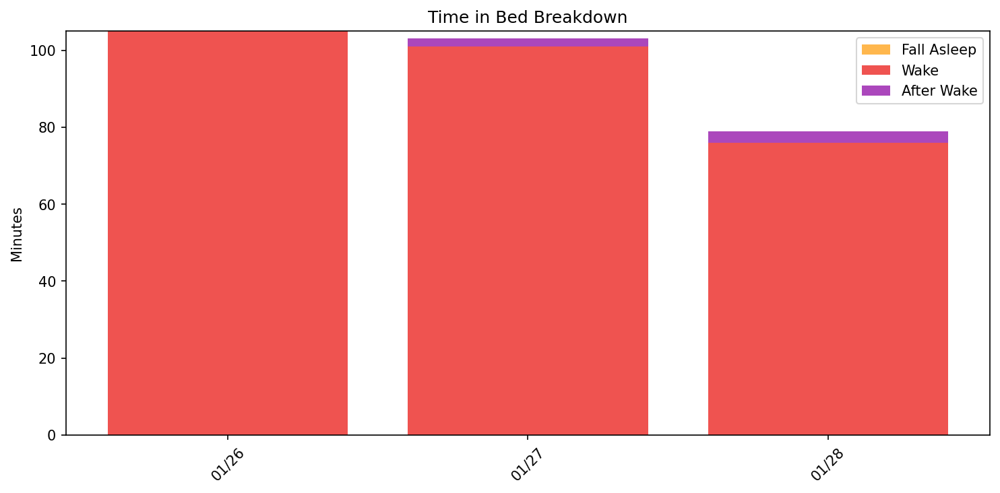
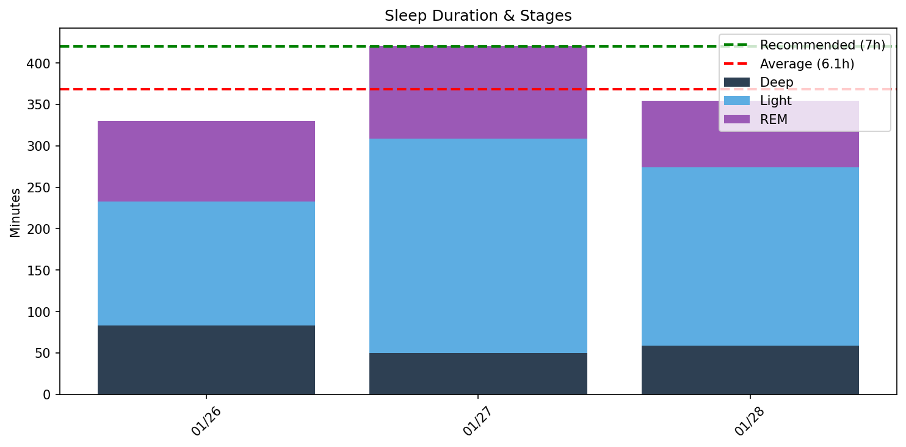
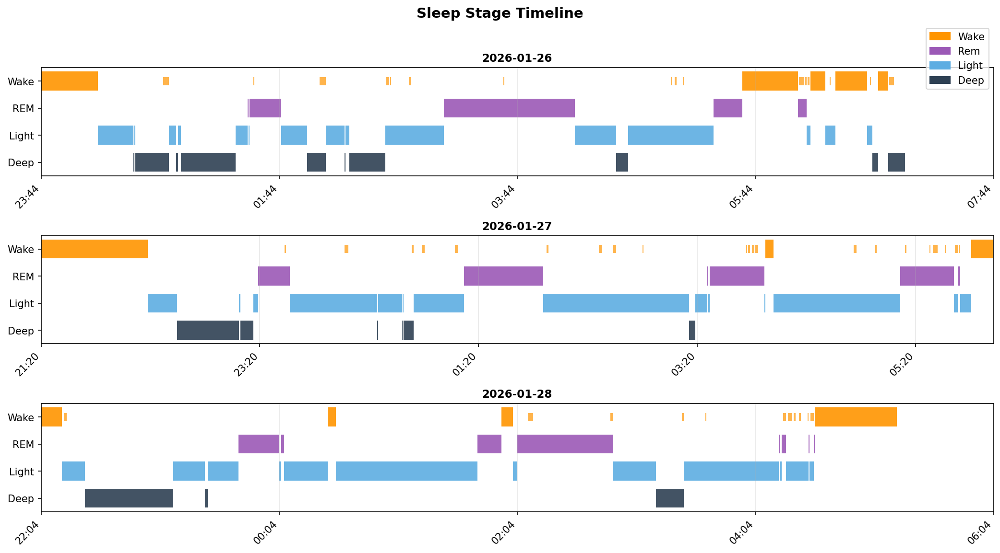
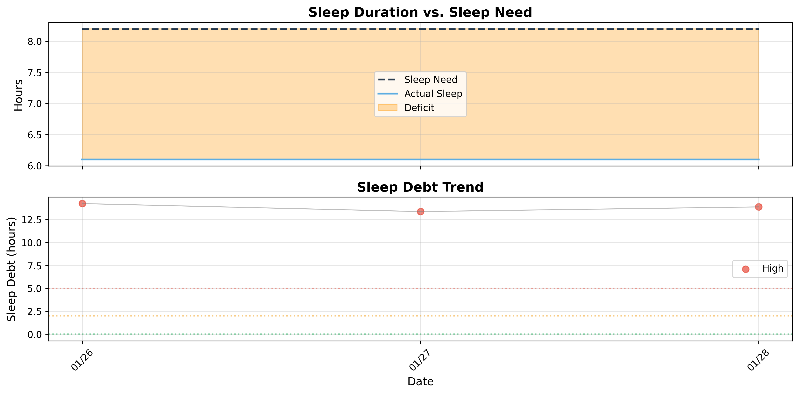

# 日次睡眠レポート

- **生成日時**: 2026-01-28 17:04:30
- **対象期間**: 2026-01-26 ～ 2026-01-28
- **データ日数**: 3日分

---

## サマリー

| 指標 | 値 |
|------|-----|
| ベッド時間合計 | 23.1時間 |
| 睡眠時間合計 | 18.4時間 |
| 平均睡眠時間 | 6.1時間/日 |

> 睡眠負債の詳細は下記の「睡眠負債分析」セクションを参照してください。
---

## Time in Bed分析

> ベッド時間の使い方を分析。効率 = 睡眠 / ベッド × 100。85%以上が良好。

| 指標 | 値 |
|------|-----|
| 平均効率 | **79.7%** |
| 最低〜最高 | 76% 〜 82% |
| 平均入眠 | 32分 |
| 平均起床後 | 18分 |

| 日付    | 効率   | 睡眠   | ベッド   | 入眠   | 起後   | 覚醒     | 回数    |
|:------|:-----|:-----|:------|:-----|:-----|:-------|:------|
| 01/26 | 76%  | 5.5h | 7.2h  | 28分  | 0分   | 105.0分 | 21.0回 |
| 01/27 | 81%  | 7.0h | 8.7h  | 58分  | 12分  | 101.0分 | 24.0回 |
| 01/28 | 82%  | 5.9h | 7.2h  | 10分  | 42分  | 76.0分  | 15.0回 |
---

## Total Sleep Time分析

> 睡眠時間の質を分析。各ステージのバランスを確認。

### 睡眠時間

| 指標 | 値 |
|------|-----|
| 平均 | **6.1時間** (369分) |
| 最短〜最長 | 5.5 〜 7.0時間 |
| 標準偏差 | 0.8時間 |

### 睡眠ステージ（平均）

| ステージ | 時間 | 割合 | 回数 | 推奨範囲 |
|----------|------|------|------|----------|
| 深い睡眠 | 64分 | 17.4% | 7回 | 13-23% |
| 浅い睡眠 | 208分 | 56.4% | 22回 | 45-55% |
| レム睡眠 | 96分 | 26.1% | 11回 | 20-25% |
| 覚醒 | 94分 | - | - | - |

| 日付    | 睡眠   | 深い    | 浅い     | レム     |
|:------|:-----|:------|:-------|:-------|
| 01/26 | 5.5h | 83.0分 | 150.0分 | 97.0分  |
| 01/27 | 7.0h | 50.0分 | 259.0分 | 112.0分 |
| 01/28 | 5.9h | 59.0分 | 215.0分 | 80.0分  |

### 睡眠ステージ タイムライン

- 🟠 覚醒 / 🟣 レム / 🔵 浅い / 🔷 深い
---

## 就寝・起床時刻

> 睡眠リズムの規則性を分析。ばらつきが大きいと社会的時差ボケの原因に。

| 指標 | 就寝 | 入眠 | 起床 | 離床 |
|------|------|------|------|------|
| 平均 | **22:22** | **22:54** | **05:12** | **06:05** |
| 最早 | 21:20 | 22:14 | 04:34 | 05:15 |
| 最遅 | 23:44 | 00:12 | 05:50 | 06:59 |
| ばらつき | ±74分 | ±55分 | ±38分 | ±52分 |

| 日付    | 就寝    | 入眠    | 起床    | 離床    |
|:------|:------|:------|:------|:------|
| 01/26 | 23:44 | 00:12 | -     | 06:59 |
| 01/27 | 21:20 | 22:18 | 05:50 | 06:02 |
| 01/28 | 22:04 | 22:14 | 04:34 | 05:15 |
---

## 睡眠中の心拍分析

| 日付 | 平均 | 最小 | 最大 | 安静時 | Baseline | Dip(%) | min HR | Daily RMSSD | Deep RMSSD |
|------|------|------|------|--------|----------|--------|--------|-------------|------------|
| 01/26 | 48 | 40 | 78 | 55 | 高10% / 低90% | - | -(-) | 32.8 | 30.1 |
| 01/27 | 48 | 40 | 81 | 53 | 高11% / 低89% | 27.7 | 05:01(461) | 47.0 | 34.6 |
| 01/28 | 49 | 40 | 91 | 52 | 高9% / 低91% | 25.8 | 03:43(339) | 40.2 | 37.5 |

**ベースライン**: 過去7日間の平均安静時心拍数（54.1 bpm）

---

## 睡眠サイクル分析

> 睡眠は約90分のサイクルで構成。深い睡眠は前半、REMは後半に集中するのが理想。

### サイクル構造の質

| 指標 | 平均値 | 正常範囲 |
|------|--------|----------|
| サイクル数 | 3.3回 | 3-5回 |
| サイクル長 | 104分 | 90分前後 |
| REM間隔 | 102分 | 90分前後 |
| 深い睡眠潜時 | 15分 | 15-30分 |
| REM潜時 | 75分 | 60-90分 |
| 前半の深い睡眠 | 95% | 70-80%以上 |

### 日別サイクル

| 日付    |   サイクル数 |   平均長 |   REM間隔 |   深い潜時 |   REM潜時 |   前半深い(%) |
|:------|--------:|------:|--------:|-------:|--------:|----------:|
| 01/26 |       3 |   108 |     118 |     18 |      76 |        92 |
| 01/27 |       4 |   111 |     118 |     16 |      60 |        93 |
| 01/28 |       3 |    93 |      70 |     12 |      89 |       100 |

## 睡眠負債分析

### 最適睡眠時間

- **最適睡眠時間**: 8.2時間
- **習慣的睡眠時間**: 5.7時間
- **潜在的睡眠負債**: 2.5時間/日
- **サンプル数**: 10日（上位4.0%）

> 睡眠時間上位4.0%（10日）の平均。習慣的睡眠（5.7h）より2.5h長く、睡眠不足からの回復を示唆。

### 現在の睡眠負債

- **睡眠負債**: 13.9時間
- **平均睡眠時間（過去14日）**: 6.1時間
- **平均睡眠時間（昼寝込み）**: 6.1時間
- **推定回復日数**: 47日

### 日別推移

| 日付    | 実績   | 負債    | 増減    | 回復   |
|:------|:-----|:------|:------|:-----|
| 01/26 | 5.5h | 14.2h | -     | 48日  |
| 01/27 | 7.0h | 13.4h | -0.9h | 45日  |
| 01/28 | 5.9h | 13.9h | +0.5h | 47日  |

---
