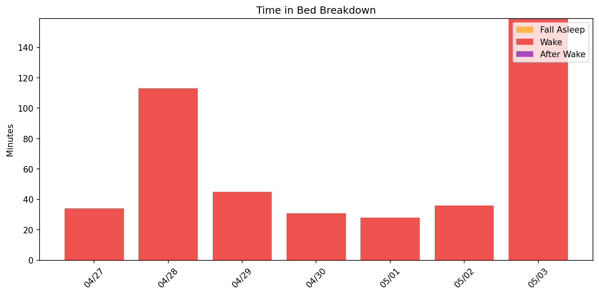
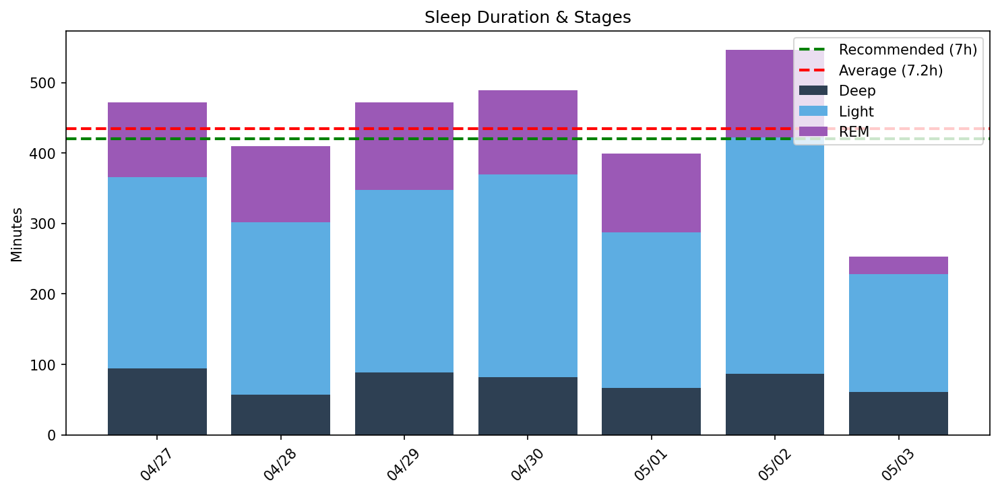
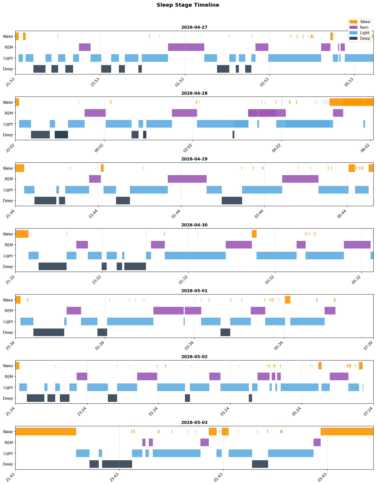
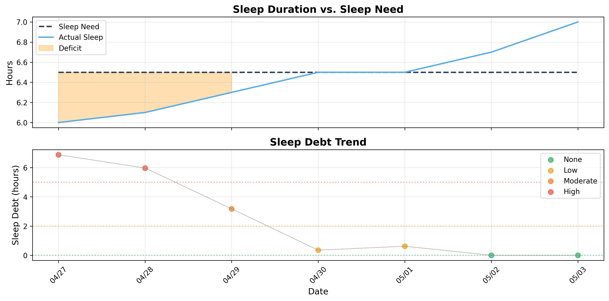

# 日次睡眠レポート

- **生成日時**: 2026-05-03 19:34:03
- **対象期間**: 2026-04-27 ～ 2026-05-03
- **データ日数**: 7日分

---

## 📊 サマリー

| 指標 | 値 |
|------|-----|
| ベッド時間合計 | 58.2時間 |
| 睡眠時間合計 | 50.7時間 |
| 平均睡眠時間 | 7.2時間/日 |

> 睡眠負債の詳細は下記の「睡眠負債分析」セクションを参照してください。
---

## 🛏️ Time in Bed分析

> ベッド時間の使い方を分析。効率 = 睡眠 / ベッド × 100。85%以上が良好。

| 指標 | 値 |
|------|-----|
| 平均効率 | **86.3%** |
| 最低〜最高 | 61% 〜 94% |
| 平均入眠 | 18分 |
| 平均起床後 | 11分 |

| 日付    | 効率   | 睡眠   | ベッド   | 入眠   | 起後   | 覚醒     | 回数    |
|:------|:-----|:-----|:------|:-----|:-----|:-------|:------|
| 04/27 | 93%  | 7.9h | 8.4h  | 4分   | 0分   | 34.0分  | 24.0回 |
| 04/28 | 78%  | 6.8h | 8.7h  | 5分   | 12分  | 113.0分 | 15.0回 |
| 04/29 | 91%  | 7.9h | 8.6h  | 12分  | 7分   | 45.0分  | 16.0回 |
| 04/30 | 94%  | 8.2h | 8.7h  | 18分  | 0分   | 31.0分  | 12.0回 |
| 05/01 | 93%  | 6.7h | 7.2h  | 6分   | 0分   | 28.0分  | 18.0回 |
| 05/02 | 94%  | 9.1h | 9.7h  | 6分   | 0分   | 36.0分  | 21.0回 |
| 05/03 | 61%  | 4.2h | 6.9h  | 70分  | 61分  | 159.0分 | 16.0回 |
---

## 😴 Total Sleep Time分析

> 睡眠時間の質を分析。各ステージのバランスを確認。

### 睡眠時間

| 指標 | 値 |
|------|-----|
| 平均 | **7.2時間** (435分) |
| 最短〜最長 | 4.2 〜 9.1時間 |
| 標準偏差 | 1.6時間 |

### 睡眠ステージ（平均）

| ステージ | 時間 | 割合 | 回数 | 推奨範囲 |
|----------|------|------|------|----------|
| 深い睡眠 | 77分 | 17.6% | 5回 | 13-23% |
| 浅い睡眠 | 255分 | 58.7% | 22回 | 45-55% |
| レム睡眠 | 103分 | 23.6% | 6回 | 20-25% |
| 覚醒 | 64分 | - | - | - |

| 日付    | 睡眠   | 深い    | 浅い     | レム     |
|:------|:-----|:------|:-------|:-------|
| 04/27 | 7.9h | 94.0分 | 272.0分 | 106.0分 |
| 04/28 | 6.8h | 57.0分 | 245.0分 | 108.0分 |
| 04/29 | 7.9h | 89.0分 | 259.0分 | 124.0分 |
| 04/30 | 8.2h | 82.0分 | 288.0分 | 119.0分 |
| 05/01 | 6.7h | 67.0分 | 220.0分 | 112.0分 |
| 05/02 | 9.1h | 87.0分 | 335.0分 | 124.0分 |
| 05/03 | 4.2h | 61.0分 | 167.0分 | 25.0分  |

### 睡眠ステージ タイムライン

- 🟠 覚醒 / 🟣 レム / 🔵 浅い / 🔷 深い
---

## ⏰ 就寝・起床時刻

> 睡眠リズムの規則性を分析。ばらつきが大きいと社会的時差ボケの原因に。

| 指標 | 就寝 | 入眠 | 起床 | 離床 | 最低HR | 日出 | 日入 |
|------|------|------|------|------|--------|------|------|
| 平均 | **21:59** | **22:16** | **05:27** | **06:18** | 03:41 | 04:54 | 18:24 |
| 最早 | 21:24 | 21:30 | 03:35 | 04:36 | 02:12 | - | - |
| 最遅 | 23:39 | 23:45 | 06:33 | 07:07 | 06:00 | - | - |
| ばらつき | ±46分 | ±43分 | ±80分 | ±49分 | ±65分 | - | - |

| 日付    | 就寝    | 入眠    | 起床    | 離床    | 最低HR   | 日出    | 日入    |
|:------|:------|:------|:------|:------|:-------|:------|:------|
| 04/27 | 21:53 | 21:57 | -     | 06:20 | 03:10  | 04:54 | 18:24 |
| 04/28 | 22:02 | 22:07 | 06:33 | 06:45 | 02:12  | 04:53 | 18:24 |
| 04/29 | 21:44 | 21:56 | 06:15 | 06:22 | 03:24  | 04:52 | 18:25 |
| 04/30 | 21:32 | 21:50 | -     | 06:14 | 03:14  | 04:51 | 18:26 |
| 05/01 | 23:39 | 23:45 | -     | 06:48 | 03:51  | 04:50 | 18:27 |
| 05/02 | 21:24 | 21:30 | -     | 07:07 | 06:00  | 04:49 | 18:28 |
| 05/03 | 21:43 | 22:53 | 03:35 | 04:36 | 03:57  | 04:48 | 18:29 |
---

## ❤️ 睡眠中の心拍分析

| 日付 | 平均 | 最小 | 最大 | 安静時 | Baseline | Dip(%) | 最低HR | Daily RMSSD | Deep RMSSD |
|------|------|------|------|--------|----------|--------|--------|-------------|------------|
| 04/27 | 45 | 39 | 62 | 49 | 高7% / 低93% | 40.3 | 317 | 48.5 | 39.6 |
| 04/28 | 44 | 39 | 74 | 49 | 高8% / 低92% | 31.7 | 250 | 39.5 | 58.7 |
| 04/29 | 44 | 39 | 100 | 49 | 高6% / 低94% | 41.5 | 340 | 52.4 | 45.9 |
| 04/30 | 45 | 40 | 98 | 49 | 高3% / 低97% | 32.7 | 342 | 37.0 | 41.5 |
| 05/01 | 45 | 39 | 85 | 50 | 高6% / 低94% | 31.0 | 252 | 38.5 | 34.4 |
| 05/02 | 47 | 40 | 98 | 51 | 高10% / 低90% | 37.2 | 516 | 33.5 | 35.3 |
| 05/03 | 50 | 41 | 90 | 53 | 高27% / 低73% | 22.3 | 374 | - | - |

**ベースライン**: 過去7日間の平均安静時心拍数（50.0 bpm）

## 🍽️ 食事分析

栄養データの翌日の睡眠心拍数データを表示しています。

| 日付 | Carbs(g) | Fiber(g) | GL | 深い(分) | 効率(%) | 最低HR | 最低HR時刻 | Dip(%) |
|------|----------|----------|-----|----------|---------|--------|------------|--------|
| 04/28 | 122 | 23 | 19.8(中) | 89 | 91 | 39 | 03:24 | 41.5 |
| 04/29 | 149 | 27 | 24.3(高) | 82 | 94 | 40 | 03:14 | 32.7 |

**GL（グリセミック負荷）**: 低 (< 10)、中 (10-20)、高 (> 20)

---

## 🔄 睡眠サイクル分析

> 睡眠は約90分のサイクルで構成。深い睡眠は前半、REMは後半に集中するのが理想。

### サイクル構造の質

| 指標 | 平均値 | 正常範囲 |
|------|--------|----------|
| サイクル数 | 4.9回 | 3-5回 |
| サイクル長 | 94分 | 90分前後 |
| REM間隔 | 92分 | 90分前後 |
| 深い睡眠潜時 | 16分 | 15-30分 |
| REM潜時 | 81分 | 60-90分 |
| 前半の深い睡眠 | 81% | 70-80%以上 |

### 日別サイクル

| 日付    |   サイクル数 |   平均長 |   REM間隔 |   深い潜時 |   REM潜時 |   前半深い(%) |
|:------|--------:|------:|--------:|-------:|--------:|----------:|
| 04/27 |       5 |    92 |      92 |     21 |      86 |        68 |
| 04/28 |       6 |    73 |      67 |     16 |      88 |        97 |
| 04/29 |       3 |   142 |     140 |     15 |      94 |        67 |
| 04/30 |       5 |    95 |      93 |     14 |      66 |       100 |
| 05/01 |       5 |    84 |      86 |     18 |      62 |        81 |
| 05/02 |       7 |    79 |      71 |     12 |      96 |        84 |
| 05/03 |       3 |    94 |      99 |     16 |      76 |        71 |

## 💤 睡眠負債分析

### 最適睡眠時間

- **最適睡眠時間**: 8.7時間
- **習慣的睡眠時間**: 5.9時間
- **潜在的睡眠負債**: 2.8時間/日
- **サンプル数**: 11日（上位4.0%）

> 睡眠時間上位4.0%（11日）の平均。習慣的睡眠（5.9h）より2.7h長く、睡眠不足からの回復を示唆。

### 現在の睡眠負債

- **睡眠負債**: 0.0時間
- **平均睡眠時間（過去14日）**: 7.0時間
- **平均睡眠時間（昼寝込み）**: 7.2時間
- **推定回復日数**: 0日

### 日別推移

| 日付    | 実績   | 負債   | 増減    | 回復   |
|:------|:-----|:-----|:------|:-----|
| 04/27 | 7.9h | 6.9h | -     | 23日  |
| 04/28 | 6.8h | 6.0h | -0.9h | 20日  |
| 04/29 | 7.9h | 3.2h | -2.8h | 11日  |
| 04/30 | 8.2h | 0.3h | -2.8h | 2日   |
| 05/01 | 6.7h | 0.6h | +0.3h | 3日   |
| 05/02 | 9.1h | 0.0h | -0.6h | 0日   |
| 05/03 | 4.2h | 0.0h | 0.0h  | 0日   |

---
