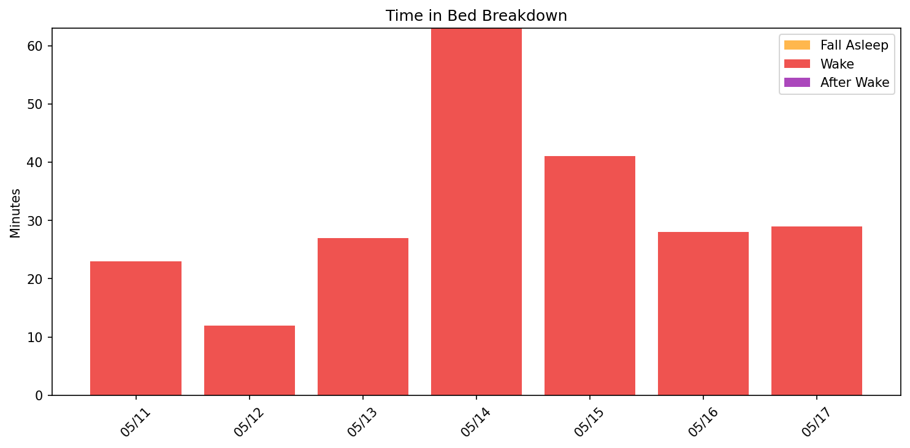
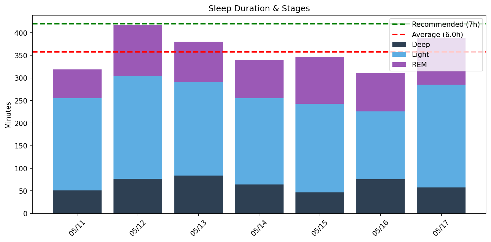
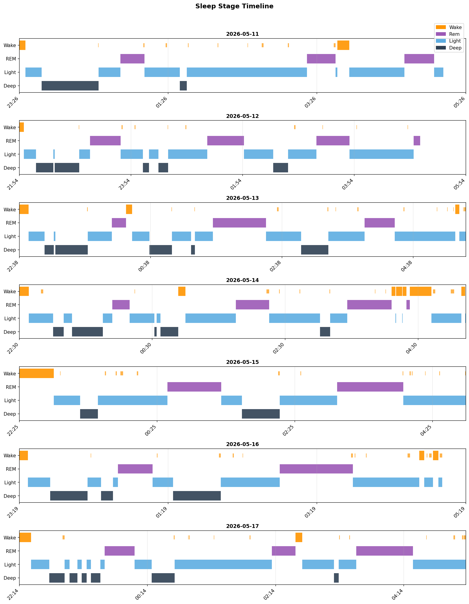
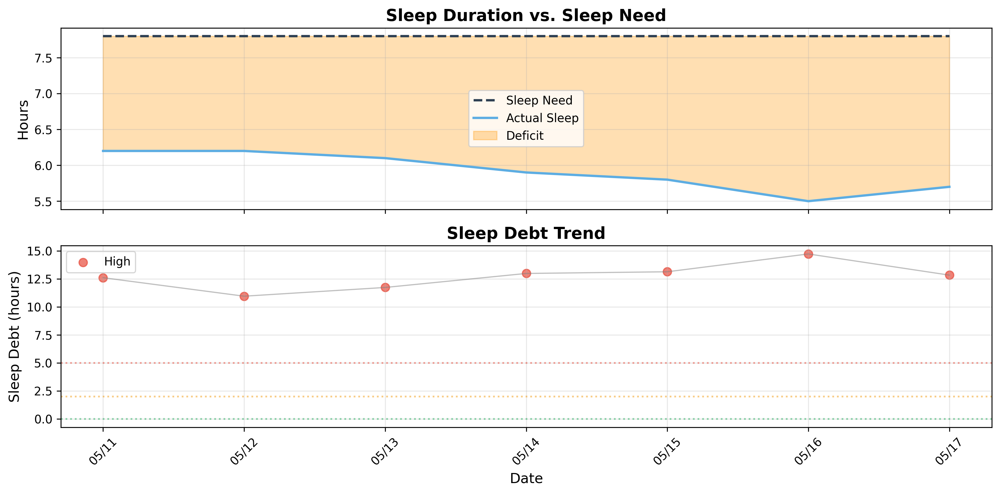

# 日次睡眠レポート

- **生成日時**: 2026-05-17 17:28:40
- **対象期間**: 2026-05-11 ～ 2026-05-17
- **データ日数**: 7日分

---

## 📊 サマリー

| 指標 | 値 |
|------|-----|
| ベッド時間合計 | 45.5時間 |
| 睡眠時間合計 | 41.8時間 |
| 平均睡眠時間 | 6.0時間/日 |

> 睡眠負債の詳細は下記の「睡眠負債分析」セクションを参照してください。
---

## 🛏️ Time in Bed分析

> ベッド時間の使い方を分析。効率 = 睡眠 / ベッド × 100。85%以上が良好。

| 指標 | 値 |
|------|-----|
| 平均効率 | **91.4%** |
| 最低〜最高 | 84% 〜 97% |
| 平均入眠 | 11分 |
| 平均起床後 | 0分 |

| 日付   | 効率   | 睡眠   | ベッド   | 入眠   | 起後   | 覚醒   | 回数   |
|:-------|:-------|:-------|:---------|:-------|:-------|:-------|:-------|
| 05/11  | 93%    | 5.3h   | 5.7h     | 5分    | 0分    | 23.0分 | 12.0回 |
| 05/12  | 97%    | 7.0h   | 7.2h     | 5分    | 0分    | 12.0分 | 10.0回 |
| 05/13  | 93%    | 6.3h   | 6.8h     | 8分    | 0分    | 27.0分 | 16.0回 |
| 05/14  | 84%    | 5.7h   | 6.7h     | 8分    | 0分    | 63.0分 | 17.0回 |
| 05/15  | 89%    | 5.8h   | 6.5h     | 30分   | 0分    | 41.0分 | 14.0回 |
| 05/16  | 91%    | 5.2h   | 5.7h     | 7分    | 0分    | 28.0分 | 15.0回 |
| 05/17  | 93%    | 6.5h   | 7.0h     | 11分   | 0分    | 29.0分 | 14.0回 |
---

## 😴 Total Sleep Time分析

> 睡眠時間の質を分析。各ステージのバランスを確認。

### 睡眠時間

| 指標 | 値 |
|------|-----|
| 平均 | **6.0時間** (358分) |
| 最短〜最長 | 5.2 〜 7.0時間 |
| 標準偏差 | 0.7時間 |

### 睡眠ステージ（平均）

| ステージ | 時間 | 割合 | 回数 | 推奨範囲 |
|----------|------|------|------|----------|
| 深い睡眠 | 65分 | 18.2% | 4回 | 13-23% |
| 浅い睡眠 | 200分 | 55.9% | 17回 | 45-55% |
| レム睡眠 | 92分 | 25.7% | 3回 | 20-25% |
| 覚醒 | 32分 | - | - | - |

| 日付   | 睡眠   | 深い   | 浅い    | レム    |
|:-------|:-------|:-------|:--------|:--------|
| 05/11  | 5.3h   | 51.0分 | 204.0分 | 64.0分  |
| 05/12  | 7.0h   | 77.0分 | 227.0分 | 114.0分 |
| 05/13  | 6.3h   | 84.0分 | 207.0分 | 89.0分  |
| 05/14  | 5.7h   | 64.0分 | 191.0分 | 85.0分  |
| 05/15  | 5.8h   | 47.0分 | 196.0分 | 104.0分 |
| 05/16  | 5.2h   | 76.0分 | 150.0分 | 85.0分  |
| 05/17  | 6.5h   | 58.0分 | 227.0分 | 103.0分 |

### 睡眠ステージ タイムライン

- 🟠 覚醒 / 🟣 レム / 🔵 浅い / 🔷 深い
---

## ⏰ 就寝・起床時刻

> 睡眠リズムの規則性を分析。ばらつきが大きいと社会的時差ボケの原因に。

| 指標 | 就寝 | 入眠 | 起床 | 離床 | 最低HR | 日出 | 日入 |
|------|------|------|------|------|--------|------|------|
| 平均 | **22:38** | **22:48** | **-** | **05:08** | 01:48 | 04:40 | 18:35 |
| 最早 | 21:54 | 21:59 | - | 04:54 | 00:33 | - | - |
| 最遅 | 23:26 | 23:31 | - | 05:26 | 03:39 | - | - |
| ばらつき | ±33分 | ±30分 | ±0分 | ±10分 | ±77分 | - | - |

| 日付   | 就寝   | 入眠   | 起床   | 離床   | 最低HR   | 日出   | 日入   |
|:-------|:-------|:-------|:-------|:-------|:---------|:-------|:-------|
| 05/11  | 23:26  | 23:31  | -      | 05:08  | 00:33    | 04:40  | 18:35  |
| 05/12  | 21:54  | 21:59  | -      | 05:05  | 00:37    | 04:39  | 18:36  |
| 05/13  | 22:38  | 22:46  | -      | 05:26  | 03:39    | 04:38  | 18:37  |
| 05/14  | 22:30  | 22:38  | -      | 05:13  | 01:08    | 04:37  | 18:38  |
| 05/15  | 22:25  | 22:55  | -      | 04:54  | 02:16    | 04:37  | 18:38  |
| 05/16  | 23:19  | 23:26  | -      | 05:00  | 03:37    | 04:36  | 18:39  |
| 05/17  | 22:14  | 22:25  | -      | 05:12  | 00:46    | 04:35  | 18:40  |
---

## ❤️ 睡眠中の心拍分析

| 日付 | 平均 | 最小 | 最大 | 安静時 | Baseline | Dip(%) | 最低HR | Daily RMSSD | Deep RMSSD |
|------|------|------|------|--------|----------|--------|--------|-------------|------------|
| 05/11 | 46 | 40 | 91 | 50 | 高12% / 低88% | 26.7 | 67 | 51.5 | 40.2 |
| 05/12 | 44 | 40 | 76 | 50 | 高9% / 低91% | 26.4 | 163 | 48.7 | 48.6 |
| 05/13 | 45 | 39 | 85 | 49 | 高11% / 低89% | 32.3 | 301 | 39.7 | 41.1 |
| 05/14 | 43 | 38 | 89 | 48 | 高7% / 低93% | 42.9 | 158 | 54.4 | 38.5 |
| 05/15 | 44 | 38 | 79 | 48 | 高11% / 低89% | 37.8 | 231 | 44.0 | 45.4 |
| 05/16 | 43 | 38 | 64 | 48 | 高4% / 低96% | 36.9 | 258 | 37.4 | 39.0 |
| 05/17 | 42 | 38 | 84 | 47 | 高6% / 低94% | 41.7 | 152 | 52.8 | 53.1 |

**ベースライン**: 過去7日間の平均安静時心拍数（48.6 bpm）

## 🍽️ 食事分析

栄養データの翌日の睡眠心拍数データを表示しています。

| 日付 | Carbs(g) | Fiber(g) | GL | 深い(分) | 効率(%) | 最低HR | 最低HR時刻 | Dip(%) |
|------|----------|----------|-----|----------|---------|--------|------------|--------|
| 05/15 | 133 | 24 | 21.7(高) | 76 | 91 | 38 | 03:37 | 36.9 |

**GL（グリセミック負荷）**: 低 (< 10)、中 (10-20)、高 (> 20)

---

## 🔄 睡眠サイクル分析

> 睡眠は約90分のサイクルで構成。深い睡眠は前半、REMは後半に集中するのが理想。

### サイクル構造の質

| 指標 | 平均値 | 正常範囲 |
|------|--------|----------|
| サイクル数 | 2.9回 | 3-5回 |
| サイクル長 | 120分 | 90分前後 |
| REM間隔 | 121分 | 90分前後 |
| 深い睡眠潜時 | 17分 | 15-30分 |
| REM潜時 | 77分 | 60-90分 |
| 前半の深い睡眠 | 90% | 70-80%以上 |

### 日別サイクル

| 日付   |   サイクル数 |   平均長 |   REM間隔 |   深い潜時 |   REM潜時 |   前半深い(%) |
|:-------|-------------:|---------:|----------:|-----------:|----------:|--------------:|
| 05/11  |            3 |      110 |       114 |         13 |        76 |           100 |
| 05/12  |            4 |      106 |       116 |         13 |        71 |            79 |
| 05/13  |            3 |      112 |       116 |         14 |        76 |            71 |
| 05/14  |            3 |      109 |       106 |         22 |        76 |            86 |
| 05/15  |            2 |      152 |       148 |         23 |        99 |           100 |
| 05/16  |            2 |      131 |       130 |         18 |        72 |           100 |
| 05/17  |            3 |      119 |       118 |         17 |        69 |            93 |

## 💤 睡眠負債分析

### 最適睡眠時間

- **最適睡眠時間**: 8.4時間
- **習慣的睡眠時間**: 5.9時間
- **潜在的睡眠負債**: 2.5時間/日
- **サンプル数**: 11日（上位4.0%）

> 睡眠時間上位4.0%（11日）の平均。習慣的睡眠（5.9h）より2.4h長く、睡眠不足からの回復を示唆。

### 現在の睡眠負債

- **睡眠負債**: 12.8時間
- **平均睡眠時間（過去14日）**: 5.7時間
- **平均睡眠時間（昼寝込み）**: 6.0時間
- **推定回復日数**: 43日

### 日別推移

| 日付   | 実績   | 負債   | 増減   | 回復   |
|:-------|:-------|:-------|:-------|:-------|
| 05/11  | 5.3h   | 12.6h  | -      | 43日   |
| 05/12  | 7.0h   | 11.0h  | -1.6h  | 37日   |
| 05/13  | 6.3h   | 11.7h  | +0.8h  | 40日   |
| 05/14  | 5.7h   | 13.0h  | +1.2h  | 44日   |
| 05/15  | 5.8h   | 13.1h  | +0.2h  | 44日   |
| 05/16  | 5.2h   | 14.7h  | +1.6h  | 50日   |
| 05/17  | 6.5h   | 12.8h  | -1.9h  | 43日   |

---
